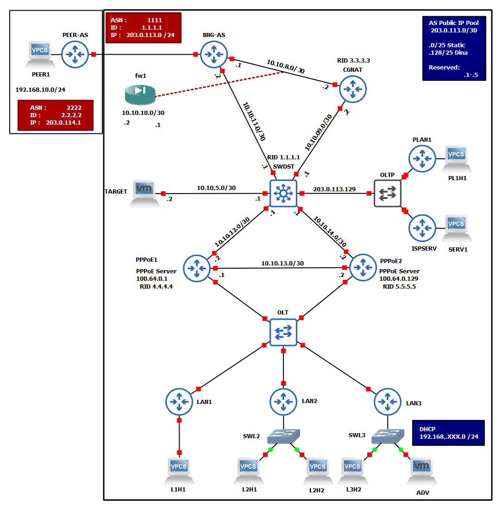
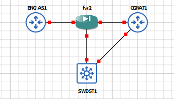

# Xarxa TFG ISP  

---

---
**Versió:** *3*  

**Nom  :** *TFG_ISP*  

---
**Descripció:**  

Aquesta última versió de la xarxa per al treball no varia molt respecte a la topologia presentada a la versió 2. Degut
als diferents canvis puntuals en alguns dispositius per realitzar algunes proves amb eines s'ha cregut convenient realitzar 
una revisió completa de la configuració de cada dispositiu. S'ha aprofitat aquesta revisió per modificar credencials de 
cada dispositiu i afegir llistes de control d'accés més específiques per simular de manera més real la configuració de la
xarxa que la ISP va descriure a les entrevistes. Addicionalment s'han corregit algunes configuracions d'encaminament.

S'ha afegit i configurat un tallafocs *fw1* amb un dispositiu pfSense, i tot i que s'han intentat optimitzar els recursos
de tots els dispositius de la xarxa, quan aquesta es troba en complet funcionament no hi ha prou recursos per que el tallafocs
funcioni tambe. Tot i així s'ha mantingut a la topologia ja que si s'aturen alguns dispositius (ISPSERV, PLAN1 i una LAN)
que no afecten al funcionament de la xarxa hi ha possibilitat de fer correr el tallafocs. Només caldrà parar els dispositius
mencionats, configurar OSPF (no és del tot necessari) i connectar les interfícies del tallafocs de la següent manera:

Aquesta xarxa i les seves configuracions haurien de permetre posar en pràctica totes les eines i tecniques descrites al llarg
del treball.

**Detalls:** 

- S'han corregit alguns problemes d'encaminament segons *origen*
- S'han corregit algunes configuracions d'interfícies i espais d'adreces.
- S'ha corregit el balanceig de càrrega dels servidors PPPoE.
- Aquells dispositius amb adreçament públic (NO CGNAT) ja no reben les adreces a partir de DHCP sino que aquestes s'assignen manualment.
- Degut a restriccions de temps, no s'han acabat implementant sistemes de segmentació de xarxa mitjançant VLANS. Aquesta 
tasca queda pendent per a treballs futurs per poder estudiar vulnerabilitats en xarxes que utilitzen VLANS.
- Es calcula que per un correcte funcionament i implementació d'aquesta xarxa i elements addicionals, farien falta de 8 a
16GB de RAM addicionals, que permetrien entre d'altres implementar un sistema IDS/IPS.
- Aquesta xarxa, tot i que es troba encara a certa distància d'una xarxa real implementada per una ISP, ha servit el seu
proposit que no era més que realitzar un estudi de xarxes ISP i la seva seguretat. Queda per a treballs futurs seguir
aprofundint en l'ús de GSN3 i la creació de xarxes més elaborades per poder apendre sobre la seguretat d'aquestes.
---
**Dispositius:**  

- **PLnHn**: Dispositius connectats a les LAN que tenen assignada una IP publica.
- **LnHn**: Dispositius connectats a les LAN.
- **ADV**: VM amb ParrotOS que simula l'adverasri.
- **LANn**: Encaminadors / Hubs de les LAN.
- **PLANn**: Encaminadors / Hubs de les LAN, amb assignació de IP pública
- **OLT**: Commutador que simula l'*Optic Line Terminal* de la ISP
- **POLT**: Commutador que simula l'*Optic Line Terminal* de la ISP per a IP publiques
- **PPPoE**: Encaminador intern de la capa d'accés. En aquesta topologia simplement actua com a GW de distribució
- **SW-DST**: Switch Multicapa. Cap utilitat en aquesta topologia.
- **BNG-AS**: *Edge Router* de la Xarxa, marca el límit de la xarxa interna amb l'exterior.
- **PPER-AS**: Simulació d'AS que connecta amb la ISP
- **CGNAT**: Servidor encarregat de les traduccions CGNAT-PUBLICA. Addiconalment balanceig de càrrega amb BNG-AS.
- **TARGET**: VM amb LUBUNTU, simula multitud de dispositius o serveis.
