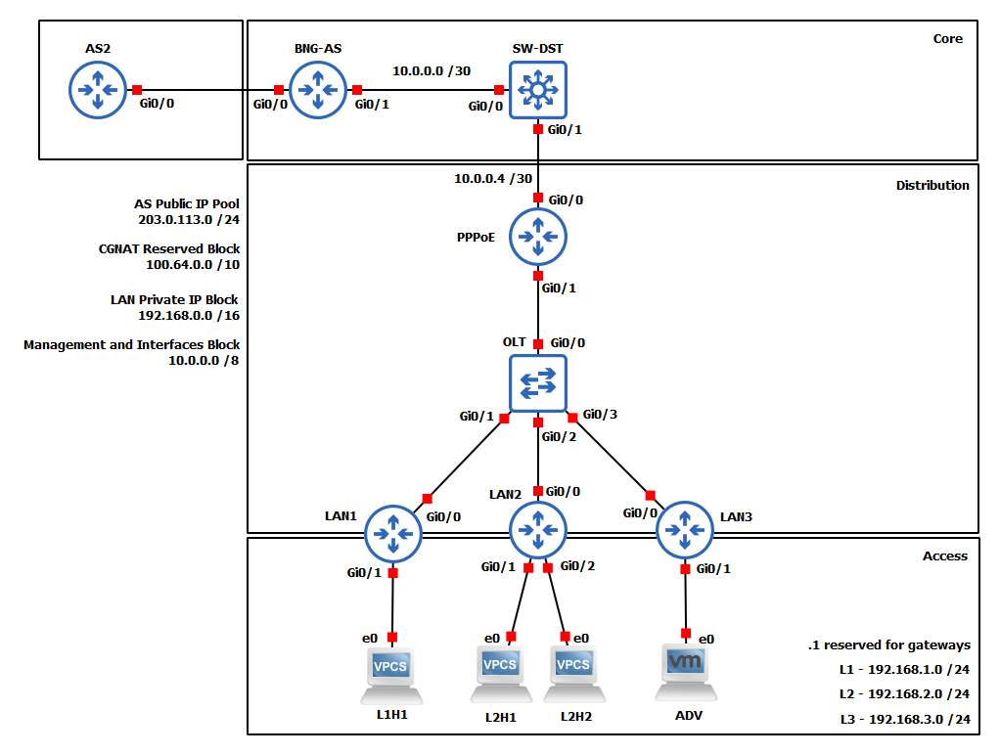

# Xarxa ISP 1   

---

---
**Versió:** *1.0*  

**Nom  :** *network1.1*  

---
**Descripció:**  
  
Per a aquesta primera versió de la xarxa d'una ISP s'ha creat una topologia bàsica juntament amb les configuracions necessàries per al correcte funcionament d'aquesta. Si bé aquesta xarxa no representa un sistema real, ja que no hi ha cap protocol d'encaminament o mesures de seguretat i control de flux implementats, aquesta xarxa permetrà posar en pràctica tècniques bàsiques de cada fase de l'auditoria.

**Detalls:**  
•	Aquesta primera xarxa s'ha dissenyat per poder posar a prova diferents tècniques bàsiques d'escaneig, enumeració i explotació.  
•	No hi ha elements de seguretat implementats i tots els dispositius disposen de connectivitat amb la resta.  
•	L'assignació d'adreces a nivell d'accés es realitza de manera estàtica així com també l'encaminament, que s'ha realitzat de manera estàtica.  
•	No s'incorporen traduccions NAT ni a nivell d'accés ni a nivell de distribució.  
•	L'equip des d'on es realitzaran les diferents proves es troba situat a la LAN 3, per tant l'accés a la xarxa es realitza de manera interna.

---
**Dispositius:**  

- **LnHn**: Dispositius connectats a les LAN.
- **ADV**: VM amb ParrotOS que simula l'adverasri.
- **LANn**: Encaminadors / Hubs de les LAN.
- **OLT**: Commutador que simula l'*Optic Line Terminal* de la ISP
- **PPPoE**: Encaminador intern de la capa d'accés. En aquesta topologia simplement actua com a GW de distribució
- **SW-DST**: Switch Multicapa. Cap utilitat en aquesta topologia.
- **BNG-AS**: *Edge Router* de la Xarxa, marca el límit de la xarxa interna amb l'exterior.
- **AS2**: *External Router*, utilitzat per connectar-hi dispositius i simular internet.
