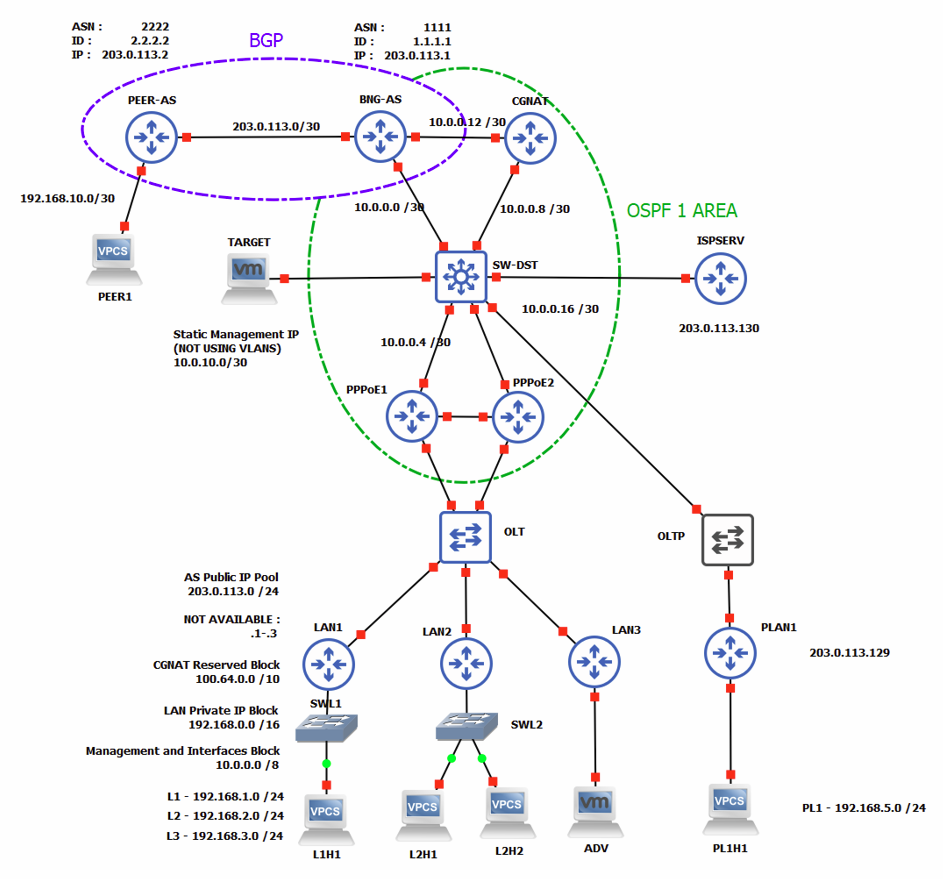

# Xarxa ISP 3   

---

---
**Versió:** *2.1*  

**Nom  :** *Xarxa 3*  

---
**Descripció:**  

Aquesta xarxa presenta un escenari més proper a la realitat que en la versió anterior. S'han implementat protocols d'encaminament
entre els dispositius al nucli-distribució, llistes de control d'accés addicionals a tots els dispositius així com alguns
serveis addicionals. En aquesta versió es podran dur a terme tecniques d'escaneig més complexes i no tant transparents
així com la possibilitat de l'existencia de vulnerabilitats addicionals degut a l'existencia de protocols i dispositius
addicionals. Addicionalment s'ha implementat al nou dispositiu CG-NAT el segon nivell de traduccions (espai CGNAT a espai PUBLIC)
Cal notar que aquells clients amb IP Publica assignada es troben connectats a un commutador OLT diferent. S'ha realitzat
d'aquesta manera a recomanació de la ISP ja que facilita l'encaminament i per tant les configuracions a realitzar a la xarxa.
Tot i que aquesta xarxa ja ressembla més a una xarxa real, encara presenta molts problemes en quant a seguretat que es podran
explorar i explotar al llarg del pentest.

**Detalls:** 

- S'ha afegit el dispositiu CGNAT que serà l'encarregat de realitzar les traduccions d'aquells hosts als que se'ls hagi
assignat una ip de l'espai 100.64.0.0/24.
- S'han assignat IP públiques (NO CGNAT) a algun host simulant clients que necessiten d'una IP pública i no poden treballar
amb doble traducció de NAT.
- S'ha afegit un dispositiu TARGET que es podrà moure per la xarxa. La funció d'aquest dispositiu pot ser múltiple. Per
una banda es farà servir per simular un sistema o servidor de gestió de la xarxa (SNMP) i per l'altra s'utilitzarà com a
sistema de monitoreig de la xarxa o sniffer (wireshark) tant per simular possibles IDS propis de la ISP com per obtenir
informació sobre les accions dutes a terme envers la xarxa per part de l'adversari. TARGET és una VM Lubuntu.
- S'ha implementat el protocol OSPF que inclou en una area els dispositius BGP, CGNAT, SWDIST i PPPOE.
- S'ha reduit al mínim les configuracions d'encaminament estàtic
- Com que no s'implementen VLANS, s'ha creat una xarxa privada de la ISP on es troba una base de dades i un servidor web (NO EN DMZ).
- No s'inclou servidor RADIUS o TACACS+ per a l'autentificació PPPOE i d'altres (no es considera necessari per el nombre
de dispositius i tampoc és viable degut als recursos necessaris i no disponibles 4kkRAM)
- S'ha afegit un dispositiu que simularà algun servei a la xarxa. S'ha decidit assignar-li una IP publica per facilitar
la implantació.
- No s'inclou tallafocs (*intentar fer-ho*)
- En alguns dispositius s'ha configurat SNMPv1/2 amb community strings **READONLY** i **WRITE/READ**

---
**Dispositius:**  

- **PLnHn**: Dispositius connectats a les LAN que tenen assignada una IP publica.
- **LnHn**: Dispositius connectats a les LAN.
- **ADV**: VM amb ParrotOS que simula l'adverasri.
- **LANn**: Encaminadors / Hubs de les LAN.
- **PLANn**: Encaminadors / Hubs de les LAN, amb assignació de IP pública
- **OLT**: Commutador que simula l'*Optic Line Terminal* de la ISP
- **POLT**: Commutador que simula l'*Optic Line Terminal* de la ISP per a IP publiques
- **PPPoE**: Encaminador intern de la capa d'accés. En aquesta topologia simplement actua com a GW de distribució
- **SW-DST**: Switch Multicapa. Cap utilitat en aquesta topologia.
- **BNG-AS**: *Edge Router* de la Xarxa, marca el límit de la xarxa interna amb l'exterior.
- **PPER-AS**: Simulació d'AS que connecta amb la ISP
- **CGNAT**: Servidor encarregat de les traduccions CGNAT-PUBLICA. Addiconalment balanceig de càrrega amb BNG-AS.
- **TARGET**: VM amb LUBUNTU, simula multitud de dispositius o serveis.
