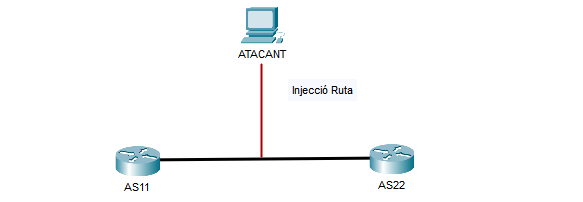
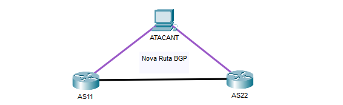
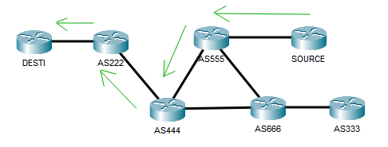
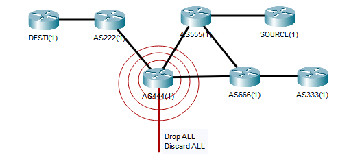

## BGP Highjacking i Blackhole routing

### Border Gateway Protocol (BGP)

BGP és el protocol encarregat d'unir mitjançant compartició de rutes els diferents AS que conformen internet. Sense aquest
protocol seria impossible per un node trobar el camí cap un altre per molt que en conegués l'adreça. L'encaminador al marge
de cada AS, mitjançant amb la resta de nodes o peers amb els que disposa d'enllaç mante i gestiona una taula d'encaminament
per als diferents prefixes d'IP públics existents a internet, d'aquí que formi part de la familia dels EGP o exterior gateway 
protocol.

Una de les fortaleses (i com es veurà també una de les possibles febleses) de BGP és la confiança cega en la resta de 
dispositius BGP, acceptant les rutes que aquests es comparteixen com a vàlides. Ara bé, el punt feble recau precisament en 
el control i protecció d'aquest dispositiu, ja que si aquest es veu compromés i un atacant envia rutes falses als veins, 
aquests les pendran com a vàlides i les escamparan per la resta de xarxa d'AS. Aquest atac és conegut com a BGP Highjacking
i és el principal problema per aquest protocol a banda de MiTM generats per el compromís del dispositiu.

#### Requisits

- Encaminador BGP, normalment el BNG o BRASS en una ISP, compromés per part de l'atacant.
- Capacitat d'injecció de rutes a la taula d'encaminament BGP del propi dispositiu de manera remota o local.

---  

#### BGP Hijacking (MiTM, Sniffing)

Tot i que totes les ISP com a AS implementen BGP, les ISP Locals o tier 3 petites amb pocs veïns no es veuran tant afectades 
o no suposaran un problema tant gran per a internet si es veuen afectats per un BGP Highjack, tot i així s'ha cregut necessari 
realitzar una petita descripció de com funciona l'atac ja que aquest protocol juntament amb OSPF i PPPoE formen l'estructura 
central del funcionament d'una ISP i no deixa d'esser un problema de seguretat de rellevància.

Es parla de segrest de BGP, quan s'aconsegueix inserir a la taula d'un encaminador, i en el seu defecte en la dels seus 
veins, una ruta modificada. La intenció d'aquesta ruta és fer creure als AS que el millor camí d'un punt A a un punt B és
passant per la màquina o encaminador de l'atacant, fet que permet a aquest capturar tot el trànsit. Si es tracta d'un
prefix d'una AS Single-homed, aquest trànsit es limitarà de manera local, pero si es tracta d'un AS Multi-homed o Trànsit
es pot arribar a capturar gran part del trànsit d'aquella zona geogràfica.

Els objectius d'aquest atac no difereixen molt d'un MiTM, i si aquest es du a terme amb éxit, es poden arribar a adquirir
credencials de tot tipus. Ara bé, degut a la possible magnitud dels atacs, aquests es solen centrar en prefixes o objectius
concrets. Un exemple seria el d'aconseguir injectar rutes per tot el trànsit d'un servei específic assignat a un prefixe 
concret per obtenir credencials d'algun tipus i així realitzar d'altres atacs a aquell servei.

Una representació senzilla de l'atac es pot veure a les següents imatges:

Tot i que el concepte per a dur a terme aquest atac resulta senzill, execurar-lo en un entorn real resulta molt complicat.
En primer lloc es necessita haver pogut comprometre un encaminador BGP, ja que si be un BGP acceptarà sense comprovar-ne
la validesa una ruta, només ho farà si aquesta li prové d'un altre dispositiu BGP autoritzat. En segon lloc, i segons la
posició en l'entramat de l'AS que es vuglui atacar, és possible que altres veins BGP ofereixin millors rutes cap a l'objectiu
i per tant no es complirà la posició MiTM que s'intenta assolir. 

Per últim i relacionat amb l'anterior punt, tot i que s'ha 
obviat de la descripció inicial, és que aquells prefixes anunciats més específics en un dispositiu tindran major preferencia
sobre aquells més generals, per exemple, 203.0.113.0/24 anunciat en un BGP tindrà prioritat sobre l'anuncia de 203.0.113.0/25
en un altre. Aquest fet fa que trobar la ruta o prefix cap a un objectiu pugui resultar complicat de realitzar ja que el 
més probable és que sempre existeixi algun altre BGP anunciat una partició més petita del prefixe. Si a aquests punts s'hi 
afegeixen aspectes de seguretat que s'estan incorporant com 'rutes signades' o ROA, els atacs BGP resulten molt complicats
de dur a terme, pero si tenen éxit poden arribar a causar grans problemes.

---

##### BGP Black Hole (DoS)

Un atac de generació de black hole és aquell atac en el que les rutes de les que disposa BGP no porten 'enlloc'. Aquesta 
situació es dona sobretot quan el destí per aquestes rutes descarta tot aquell trànsit que li arriba i a la seva vegada 
no envia resposta de la 'no entrega' a qui hagi enviat aquell trànsit. El problema d'aquest tipus d'atacs de denegació de
servei resideix en que aquestes rutes si es comparteixen amb prous veïns i s'escampen per la resta de AS, poden arribar a
fer desapareixer prefixes sencers de la xarxa. A les següents imatges s'exemplifica el procés de l'atac.

- La ruta normal de la que tots els dispositius disposen a la seva taula d'encaminaments per anar de source a destí és la 
que es veu marcada en verd a la primera imatge.

- L'encaminador en vermell, que ha sigut vícitima d'un atac i a la que se li han modificat rutes d'encaminament, transmet
als seus veins, que per anar a destí, han de passar per ell, pero en comptes de reenviar els paquets, aquest els envia
a un dispositiu NULL o bé els descarta tots sense enviar missatges d'error de tornada.

Tal i com es comentava, la modificació d'una taula BGP d'un AS amb pocs veïns no tindrà molta repercusió, ja que poc trànsit
passa per aquest AS en comparació amb d'altres més grans. Així doncs, AS de tipus Trànsit en gran mesura i Multihomed que
es vegin afectats per un black hole suposaran una denegació de serveis a gran escala mentre que AS de tipus Single-homed
com és el cas d'una ISP local, tot i que patiran afectació de denegació de servei, no extendran molt aquest a la resta 
d'internet.

---

Aquests dos atacs i alguns d'altres tenen un punt en comú, i és l'explotació de dispositius vulnerables. Sense accés a aquests,
un atac a BGP directe és gairebé impossible, així doncs, la majoria d'atacs seran autoritzats per males configuracions per
part dels administradors de la xarxa d'una ISP. Així doncs, tot i que realitzar explotacions de BGP a la xarxa d'una ISP 
local podria veure's com una mesura extrema i costosa en temps que potser no cal afegir a l'abast de l'auditoria, si que
cal almenys posar a prova la seguretat dels dispositius que implementen BGP i determinar que si aquests es poden comprometre,
BGP també es podrà.

En quant a les proves a realitzar per emular aquests treballs, no s'ha disposat de la suficient capacitat tecnica per dur-les
a terme, pero s'espera poder en treballs futurs de creació de laboratoris amb GSN3, generar un entorn que permeti posar
en pràctica aquests atacs.

A tall d'exemple, el següent codi amb Scapy genera els 3 tipus principals de missatges que es podrien fer servir en atacs
a BGP. Per altra banda no s'ha cregut necessari incloure les configuracions realitzades sobre un encaminador compromés doncs
aquestes són senzilles i es poden trobar als corresponents manuals per cada dispositiu així com als arxius de configuració
dels dispositius de les xarxes plantejades en aquest treball amb GSN3. Cal notar que previ enviament d'aquest missatge s'haurà 
de realitzar una connexió TCP amb el destí, ja que tot i que tal i com s'ha descrit amb anterioritat, tot i que BGP realitza 
funcions d'encaminament, es tracta d'un protocol a nivell d'aplicació. un exemple de la construcció amb scappy d'aquesta
sessió es pot trobar a internet en repositoris com [aquest](https://gist.github.com/N0dr4x/ffe99618a738978605719ce525a33042)
(*S'ha examinat el codi pero no s'ha posat a prova*).

##### BGP Open Message

`bgp_open = BGPOpen(version=4, my_as=1111, hold_time=180, bgp_id='1.1.1.1')`  
`bgp_open_packet = Ether() / IP() / TCP() / bgp_open`

##### BGP Keepalive Message

`bgp_keep = BGPKeepAlive()`  
`bgp_keep_packet = Ether() / IP() / TCP() / bgp_keep`  

##### BGP Update Message

`bgp_update = BGPUpdate(path_attr=[BGPPathAttr(), BGPPathAttr()])`  
`bgp_update_packet = Ether() / IP() / TCP() / bgp_update`  

