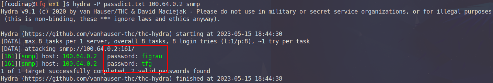
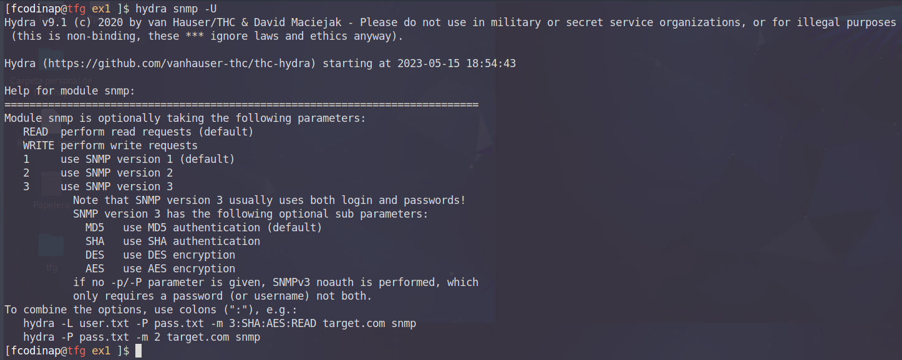

## Hydra
### Lloc Official Eina
- https://github.com/vanhauser-thc/thc-hydra

--- 

### Accés a mode privilegiat Cisco Enable

#### Requisitis  
- Accés remot al dispositiu  
- Credencials d'accés al dispositiu (veure obtenció d'accés mitjançant atacs de diccionari)  

Una vegada s'ha identificat un dispositiu objectiu i es disposa d'alguna credencial en la forma d'usuari/clau per accedir
a aquest, hydra disposa de la possibilitat de posar a prova l'accés a mode privilegiat d'aquest a partir d'un possible
diccionari de claus. L'accés a mode privilegiat suposa una de les escalades de privilegi més grans que es podrà trobar en
una xarxa d'una ISP i suposarà un greu perill ja que arrel d'aquesta situació es poden desencadenar multitud d'atacs DOS
de manera directa i senzilla.

#### Comanda  
`hydra -l <usuari> [opcions] -m <clau> <diccionari.txt> <adreça_objectiu> <modul>`

#### Opcions i Paràmetres Especials  
`-l <usuari>:` login  
`-m <opcions> :` opcions específiques del mòdul  
`-P <wordlist>:` diccionari  
`-f:`  acabar cerca quan es trobi la primera clau vàlida

#### Execució  
A partir de la informació recopilada en fases anteriors es disposa d'un nom d'usuari *admin* i una clau d'accés *tfg*. 
Amb aquestes credencials podem accedir mitjançant un dels protocols d'accés remot al dispositiu. Construirem la comanda
d'aquest exemple amb els paràmetres necessaris, fent ús del modul d'Hydra **cisco-enable**.

`hydra -l admin -f -m tfg passdict.txt 100.64.0.2 cisco-enable`

Als resultats que proporciona Hydra es pot observar com s'ha trobat una clau vàlida que proporciona accés a mode privilegiat
i només caldrà connectar-se a través de telnet amb `telnet 100.64.0.2` accedir al dispositiu, entrar al mode privilegiat 
i introduir la clau trobada.

Rarament resultarà tant senzill, pero d'assolir aquest nivell d'accés es podria dir que es te control gairebe complert 
sobre aquell domini de la xarxa i totes les funcions o serveis que el dispositiu pogués oferir.

---  

### Accés a mode privilegiat en dispositius Cisco sense coneixer les credencials d'accés

#### Requisitis  
- Accés remot al dispositiu.   
- Diccionaris de credencials.  

Mentre que el mòdul utilitzat a l'exemple anterior **cisco-enable** requereix d'unes credencials d'accés previes, si no es
disposa d'aquestes una manera d'aconseguir-les és utilitzant el modul ssh, que permetrà passar tant una llista d'usuaris
i una de claus. Una vegada s'obtinguin, es podrà seguir el mateix procediment anterior per obtenir l'accés.

#### Comanda  
`hydra -L <userlist.txt> -P <passwordlist.txt> -f <adreça_objectiu> <modul> [opcions]`

#### Opcions i Paràmetres Especials  
`-L <usuari>:` login   
`-P <wordlist>:` diccionari  
`-f:`  acabar cerca quan es trobi la primera clau vàlida
`-t <n>:` grau de paralelisme (threads) de l'execució

#### Execució 

Coneixent que el dispositiu te ssh com a protocol d'accés remot activat, executem la comanda amb el modul ssh i dues
llistes, una d'usuaris i l'altra de claus.

`hydra -L userdict.txt -P passdict.txt 100.64.0.2 ssh -t 1`

Hydra procedirà a probar les combinacions existents i retornarà una combinació en forma de `usuari@adreça:clau` en cas de 
que s'hagi pogut realitzar l'accés. Mitjançant aquestes credencials es podrà dur a terme l'atac anterior que podria 
resultar en una escalada de privilegis en el dispositiu.

Passem el nom d'usuari i clau d'accés a l'anterior comanda per probar d'escalar privilegis amb el modul cisco-enable.
Per fer-ho emmagatzem les claus trobades i les passem com a arguments a la comanda d'hydra. Serà precís que la comanda
emmagatzemi els resultats en un arxiu d'on es puguin extreure les claus fent ús de `> resultats_ssh.txt`.

Seguidament extraiem les credencials de l'*output* i les emmagatzemem en variables.

`user=grep login: ssh_results.txt | awk '{print $5}'`  
`pass=grep login: ssh_results.txt | awk '{print $7}'`

`hydra -l $user -f -m $pass -P passdict.txt 100.64.0.2 cisco-enable`

I s'haurà pogut assolir l'escalada de privilegis al dispositiu. En cas de tenir èxit i per tant obtenir accés privilegiat
a algun d’aquests dispositius, es disposa de control complert sobre la configuració d’aquests: canvi d’encaminaments 
estàtics i protocols d’encaminament, exportació/importació de configuracions, activació d’altres serveis, generació de 
nous usuaris i claus per a obtenir persistència o fins i tot la inutilització completa de dispositiu. Aquesta situació 
caldrà ser avaluada en funció dels objectius que es tinguin ja que pot interessar una o altra opció en funció del punt 
en el que es trobi el procés de pentest. Alhora, resultarà de molta utilitat disposar d’experiència treballant amb aquests
dispositius i dels manuals corresponents d’aquests per poder aprofitar aquest accés, informació que s’hauria d’haver 
recopilat una vegada descoberts els dispositius a la fase d’escaneig.

---  

### Obtenció de SNMP Community Strings

#### Requisitis   
- Diccionari de *Community Strings*.  
- Servei SNMP actiu (161/162)

Un altre ús interessant d'Hydra de cara a obtenir informació addicional sobre el dispositiu és la de l'obtenció de *CommunittyStrings*
que es podran utilitzar en d'altres atacs. El módul `snmp` d'hydra utilitzarà una llista de possibles valors i retornarà
tots aquells que s'hagin configurat en un dispositiu.

#### Comanda  
`hydra -P <communitystrings.txt> <adreça_objectiu> <modul>`

#### Opcions i Paràmetres Especials
`-P <wordlist>:` diccionari

#### Execució 

Si el port que utilitza SNMP s'ha pgut determinar com obert en el dispositiu d'encaminament, mitjançant una possible llista
de community trings per defecte o possibles, podem posar a prova el dispositiu per veure si ens retorna resultats positius.

`hydra -P passdict.txt 100.64.0.2 snmp`
  
  
  
Addicionalment, com que aquesta informació s'utilitzarà en futures explotacions, resultarà d'interés emmagatzemar totes 
aquelles strings que es trobin. Així doncs redirigirem l'output per poder disposar d'ell en forma de llista.

`hydra -P passdict.txt 100.64.0.2 snmp | grep password: | awk '{print $5}' >> com_strings.txt`

`cat com_strings.txt` 
> figrau  
> tfg  

>**Nota:** Caldrà coneixer la versió de SNMP que s'utilitza en aquell dispositiu així com d'altres paràmetres. Les opcions
> addicionals que es poden utilitzar per al módul SNMP d'Hydra són els següents:

`hydra snmp -U`  
  
  

