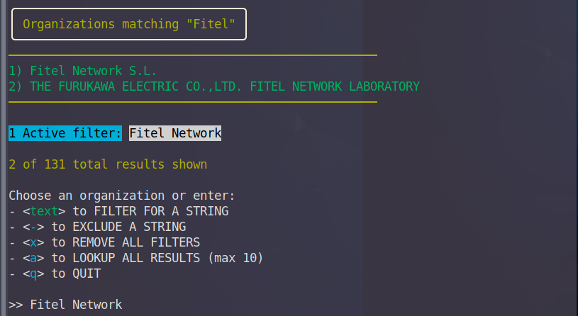
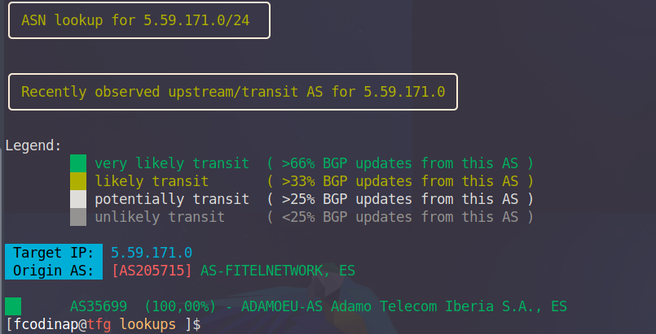

## LOOKUPS
Existeixen a la xarxa multitud d’eines de cerca més especialitzades que no pas els cercadors tradicionals i que seran 
d’utilitat quan es necessiti trobar una informació concreta. Aquestes eines reben el nom de Lookups (Cerques) i es poden
trobar pràcticament per a cada tipus d’informació existent. En el cas d’una ISP pot interessar trobar informació sobre 
direccions IP, sobre localització geogràfica i molts d’altres. A continuació s’enumeren aquelles eines de cerca que es 
consideren més rellevants i que s’utilitzarien en el cas de recopilar informació d’una ISP.  

### ASN I BGP LOOKUP  

Una ISP ha de disposar d’un identificador ASN i per obtenir-lo, tal i com ja s’ha descrit en anteriors apartats és necessari 
que implementi BGP. Tota la informació que genera BGP i les propietats d’un ASN es troba emmagatzemada per el respectiu RIR  
al que pertanyen les IP públiques que la ISP té assignades. Existeixen moltes eines com BGP View  que mitjançant el nom 
del ASN realitzarà un whois  a la base de dades del RIR. Entre d’altres moltes dades que retornarà la cerca es poden observar
les següents:

- Resum de la ASN: Data d’assignació de l’identificador, transit estimat, tipus de trànsit més habitual, nombre de IP 
de les que disposa així com els prefixes.  
- Adreces tant físiques com de correu electrònic  
- Veïns en el protocol BGP  
- Encaminament que segueix el transit sortint en forma de graf  
- Arxiu WHOIS, d’on es podrà extreure molta informació addicional de la organització.  
- Una llista amb els prefixos IP.  

### IP LOOKUP  

Els IP lookups retornaran tota la informació disponible sobre una adreça i actualment n’existeixen centenars de disponibles. 
Un exemple (el primer que apareix en una cerca a Google) seria WhatsMyIp , on introduint una direcció IP es rebrà un resum 
d’informació relacionada amb aquella direcció com l’AS a qui es troba assignada aquesta o informació geogràfica.

### MÉS ENLLÀ DELS LOOKUPS
Quan es treballa sobre la recopilació d’informació d’una ISP, a banda de les dades que es puguin obtenir de caire empresarial 
com el CIF, adreces i d’altres, es voldrà obtenir tota aquella informació més específica com identificador AS, bloc d’adreces 
IP de les que disposa, abast de la seva xarxa i possibles models de dispositius que utilitzi entre d’altres. De nou, aquesta 
informació es recupera de consultes que les eines realitzen sobre la base de dades del RIR respectiva així com de possibles 
bases de dades privades.

---  

A l’hora de realitzar cerques, les dos cerques anteriorment mencionades seran els principals quan es treballi sobre una ISP, 
però si es vol ampliar informació o no s’ha trobat aquella que es creu necessària, sempre es poden realitzar cerques addicionals 
amb d’altres serveis de lookup que es poden trobar al segon apartat de Osint Tecniques  així com a l’apartat corresponent 
de OSINT framework .

Per altra banda cal destacar que tots aquests lookups realitzats a través de cercadors webs poden realitzar-se també a través 
de comandes si no es disposa de navegador web. Simplement caldrà realitzar la consulta corresponent a les bases de dades del 
RIR mitjançant l’API que aquesta proporciona.  Comandes com dig  o whois  o eines com ASN Lookup Tool and Traceroute Server  
permetran recuperar la mateixa informació que les versions corresponents utilitzades en navegadors. Si bé l'ús de navegadors
pot resultar més comode, mitjançat l'ús de comandes es podrà desar i tractar la informació de manera més eficaç. A continuació
es presenten alguns exemples de lookups amb diferents comandes.

#### Lookups mitjançant comandes

En molts casos al realitzar un pentest sobre una xarxa es disposarà únicament d'un conjunt d'adreces públiques que pertànyen
a la ISP sobre la que s'està treballant. Mitjançant aquestes adreces es pot realitzar una cerca d'informació fent ús de la
comanda dig. Dig realitzarà DNS Lookups i retornarà informació sobre la cerca que pot ser d'utilitat per iniciar la fase
de reconeixement inicial d'un pentest. A continuació es presenta un exemple d'ús bàsic, que pot ser ampliat i modificat 
a partir de les opcions que es poden veure a `man dig`.

`dig $(dig -x 5.59.171.1 | grep PTR | grep -Eo '[0-9]{1,3}\.[0-9]{1,3}\.[0-9]{1,3}\.[0-9]{1,3}').origin.asn.cymru.com TXT 
+short > dig_lookup.txt`

**Opcions**

- `x`: S'indica que en comptes d'un nom es passa una adreça IP
- `grep PTR`: Selecciona els registres PTR
- `grep -Eo`: Selecci`s d'adreces IP
- `+short`: versió resumida de l'output

Els resultats es presenten en les següents columnes: ASN, Prefixe, Pais, RIR i data d'assignació. Aquest resultat es pot
començar a emmagatzemar per al procés de recerca d'informació i el seu ús posterior.

> "205715 | 5.59.171.0/24 | CZ | ripencc | 2012-06-04"  

`ASN=cat dig_lookup.txt | sed 's/["]//g' | awk '{print $1}'`  
`IP=cat dig_lookup.txt | sed 's/["]//g' | awk -F'|' '{print $2}'`  

`echo 'AS'$ASN 'owns:'$IP`  

> AS205715 owns: 5.59.171.0/24  

Tot aquest procés es pot automatitzar mitjançant la creació d'un script per disposar de manera ràpida d'un ASN Lookup. A tall
d'exemple s'inclou `asn_lookup.sh` que realitzarà tots els passos anteriors.

Una manera d'obtenir tota la informació de la que disposa el RIR és mitjançant la comanda `whois`

`whois $IP` o `whois echo AS$ASN`

Aquesta preo caldrà revisar-la manualment i obtenir la infromació desitjada, o be emmagatzemar tot el retorn per disposr
d'ell en un futur. Altres possibles opcions de filtratge segons el tipus d'objecte de la base de dades del RIR, com per 
exemple amb la comanda `whois -T route $IP` es filtrarà el resultat únicament per l'objecte ruta(ultim apartat). Addicionalment
és possible que interessi trobar prefixes addicionals dels que disposa la ISP, a banda del que s'ha utilitzat per a la cerca 
inicial. Si es realitza un filtratge per origen es poden trobar aquestes en cas de que existeixin i emmagatzemar-les per
disposar d'aquests a la fase d'enumeració i escaneig.

`whois -h whois.radb.net -- '-i origin AS205715' | grep route | awk '{print $2}' | sort | grep -Eo '[0-9]{1,3}\.[0-9]{1,
3}\.[0-9]{1,3}\.[0-9]{1,3}\/[0-9]{1,2}' > asn_prefixes.txt`

> 109.205.247.0/24  
> 188.95.148.0/23  
> 45.88.157.0/24  
> 5.59.171.0/24  
> 5.59.174.0/23  
> 5.59.77.0/24  
> 92.119.184.0/23  
> 94.125.96.0/23  
> 94.125.96.0/24  
> 94.125.97.0/24  

---

#### Altres eines per a Lookups

A banda de les comandes que es poden utilitzar per defecte, existeixen eines que permetran la realització de lookups de 
manera més fluida. Aquestes es poden trobar amb una cerca ràpida en repositoris com la [següent](https://github.com/topics/asn-lookup)
A tall d'exemple es farà ús de l'eina [asn](https://github.com/nitefood/asn), que realitzarà les consultes contra Shodan
(veure apartat SHODAN) i d'altres bases de dades.

Instalem l'eina i executem algunes cerques (es requereix de privilegis)

`curl "https://raw.githubusercontent.com/nitefood/asn/master/asn" > /usr/bin/asn && chmod 0755 /usr/bin/asn`

- `sudo asn $IP`  

Realitzarà una cerca bàsica/default que inclou un ASN Lookup, un trace i un path per a l'adreça.

- `sudo asn echo AS$ASN`  

Al introduir el ASN, es realitzarà una cerca detallada en aquest cas sobre la ISP. Aquesta cerca
és probablement la que més interessarà ja que a banda de la informació bàsica sobre l'AS, es retorna informació relativa
a BGP, com els veins i la posició d'aquests.

- `sudo asn -o <nom_isp>` i  `sudo asn -a <nom_isp>`  
- 

Realitzarà una cerca d'organitzacions per nom. De gran utilitat quan el nom de l'organització del que es disposa no coincideix 
amb el nom assignat al AS.

- `sudo asn -u $IP`  

Informació addicional sobre BGP i trànsit al analitzar la ISP i les seves relacions amb possibles veïns.

- `sudo asn -s $IP` 

Realitzarà un escaneig sobre Shodan. Aquesta acció pot entendres més com part de la fase d'ennumeració
ja que retornarà informació sobre ports i serveis. A tall d'exemple es pot realitzar la següent consulta a Shodan passant
les adreces que s'havien trobat anteriorment amb els lookups mitjançant comandes.

`sudo asn -s < asn_prefixes.txt`

---

De totes les opcions o eines presentades en aquest apartat, tot i requerir un cert temps d'aprenentage, la última presentada
(asn) ha resultat ser la que més potencial pot arribar a tenir ja que es disposen de múltiples opcions i bases de dades
amb les que treballar i permetrà treballar amb altra informació de la que ja es disposi a l'hora de realitzar una cerca. 

El fet de que tambe disposi de la possibilitat de realitzar consultes a Shodan serà de gran utilitat a l'hora de combinar 
els resultats d'aquestes dues eines. Mitjançant aquest es podra obtenir l'OSINT que es considera necessari per a la realització 
d'un pentest en una ISP mitjançant IP Lookups, ASN Lookups i BGP Lookups.

