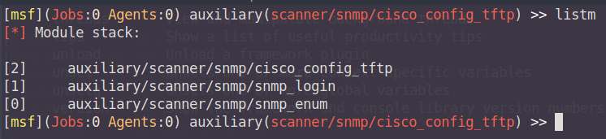

## Metasploit com a Framework per a pentests
### Lloc Official Eina
- https://www.metasploit.com/

--- 

### Metasploit
Metasploit és una de les eines més complertes a l’hora de dur a terme explotacions de vulnerabilitats ja sigui directament 
mitjançant els mòduls que la componen o com a reforç quan s’utilitzen eines de tercers o fabricació pròpia. Aquesta eina 
desenvolupada i gestionada per Rapid7 es pot trobar en diferents formes incloent una recent que incorpora GUI per a un ús 
més intuïtiu i integrat. El Metalsploit (MS a partir d’ara) al que es farà referencia al llarg d’aquest treball és el que
s’executa des de la consola o MSFconsole i el que la majoria de sistemes enfocats a la seguretat informàtica i pentesting 
porten incorporat, com és el cas de la MV amb ParrotOS que s’utilitza com a màquina adversària al llarg dels exemples d’aquest 
treball.

A banda de funcionalitats bàsiques com la definició de variables de l’entorn, es pot definir MS com un conjunt de famílies
de mòduls, cadascun dels quals serà utilitzat per una tasca concreta al llarg del pentest. Aquestes famílies de mòduls 
juntament amb una petita descripció que també es pot trobar a la base de dades de mòduls de InfosecMatter  en són les següents:

- **Exploits**  
Tots aquells mòduls enfocats a explotar una vulnerabilitat.  
- **Payloads**  
Mòduls que realitzen una acció concreta durant l’explotació. Aquests solen acompanyar o són cridats per   
els anteriors i són encarregats de generar el contingut que s’envia amb un exploit.  
- **Post**  
Mòduls enfocats a la post explotació, ja sigui per a l’extracció d’informació, l’ escalada de privilegis o la generació 
de persistència en un sistema
- **Auxiliary**  
Es troba format per eines de suport com escaneig, creació de serveis d’emmagatzematge, comunicació entre serveis o eines 
d’atacs a claus entre d’altres
- **Enconders**   
Mòduls que realitzen tasques d’ofuscació, encriptació i codificació.
- **Evasions**  
Mòduls que ajudaran a esquivar o enganyar sistemes de protecció com tallafocs o IDS
- **Nops**  
Mòduls d’ajuda i control a moviments sobre la memòria d’un sistema (de la operació NOP o no-operation en codi assemblador), 
per assegurar que les operacions que es realitzen o el payloads que es carreguen en un exploit es fan en el lloc indicat, 
per exemple, en el cas de realitzar un atac que es beneficia de desbordament de memòria, un mòdul d’aquesta família s’assegurarà 
que el payload es carrega a la posició correcta.

---  

###### Cerca d'Exploits segons definició CVE i Paraules Clau

MS disposa de centenars de funcionalitats, particulars per a cada tipus de vulnerabilitat. Una de les claus en l’ús de MS 
és el de cercar exploits o mòduls per a una CVE en concret. La cerca d’aquests es pot realitzar de diferents maneres:

`search dos`  
Retornarà tots aquells mòduls emprats en explotacions de vulnerabilitats i atacs de denegació de serveis

`search cve:2019 port:80`  
Retornarà tots aquells mòduls que fan referencia a vulnerabilitats de l’any 2019 a la base de dades de CVE en les que 
s ’utilitza el port 80.  

`help search`  
Per obtenir més informació sobre camps amb els que es pot filtrar la cerca.   

---  

###### Configuració entorn Metasploit

Una de les facilitats que incorpora MS és la d’establir certes variables d’entorn per poder treballar de manera més còmode. 
Algunes d’aquestes variables són:

- `RHOST` i `RHOSTS` per a definició d’objectius  
- `LHOST` per a definir el localhost  
- `LPORT` per definir ports locals   
- `RPORTS` per definir port del target  

Aquestes variables es poden definir mitjançant la comanda set. Al següent exemple es defineixen aquests objectius que es 
voldran utilitzar per intentar connectar-se de manera remota mitjançant Telnet.Així mateix, si es vol definir una variable
de manera global s'utilitzarà `setg` i els canvis es podran observar a qualsevol módul que s'utilitzi.

`set RHOSTS 100.64.0.1-5`  
`set RPORT 23`  
`setg SHOST 192.168.3.2`  

---  

###### Moduls auxiliars  

Encara que no es faci servir MS per executar explotacions concretes, aquest framework segueix sent de gran utilitat gràcies 
als mòduls auxiliars, que realitzaran tasques de suport al llarg de l’execució d’un exploit o atac. Existeixen multitud 
de mòduls, que a mida que es vagi guanyant experiència en l’ús de MS s’aniran coneixent i provant. MS és un framework 
molt complert i que quan es disposa d’experiència d’ús pot resultar una eina indispensable per a qualsevol pentester.  

Alguns d'aquests móduls són els que es poden veure en exemples de tecniques i eines com TFTP/FTP o SNMP. En la versió actual
de MS existeixen al voltant de 1200 móduls auxiliars i continuació es pot observar un petit estudi d'algun d'aquests móduls 
que podran ser d'utilitat o interessants a l'hora de dur a terme un pentest en una ISP.

**Scanner/portscan/...**  
Moduls que executen tasques d'escaneig similars a les de NMAP, d'utilitat per realitzar una ennumeració generica sense
haver d'executar NMAP.

`use /portscan/tcp`  
`set RHOSTS 100.64.0.0/24`  
`set PORTS 1-100`  
`exploit`  

**Scanner/snmp/...**
Veure també els apartats SNMP i FTP/TFTP d'aquest treball. Proporcionen utilitats relacionades amb Simple Network Management
Protocol.

`use /snmp/snmp_login`  
`set RHOSTS 100.64.0.0/24`  
`set RPORT 162`  
`exploit`  

**Scanner/ssh/...**
Utilitat per a ennumeracions o atacs d'accés a serveis ssh

`use /ssh/ssh_login`  
`use 0`  
`set RHOSTS 100.64.0.129`  
`set RPORT 21`  
`exploit`  

---

###### La base de dades de Metasploit  

Molts dels moduls de MS poden o faran ús de variables emmagatzemades i oferiran la possibilitat d'emmagatzemar 
resultats. Una eina que incorpora MS, és la creació i gestió d'una base de dades. Per iniciar aquesta si no s'ha fet ja
(Normalment al iniciar MS aquest ja comprova si hi ha un servei de base de dades actiu i configurat) es pot realitzar amb
les següents comandes

systemctl start postgresql

`msfdb init`  
`db_status`  

Per navegar i crear una nova entrada

`workspace`  
`workspace -a tfgMSF`  
`workspace tfgMSF`  

Les comandes per a la gestió dels espais de treballs les podem enumerar amb   
`workspace -h`  

Un dels molts usos que es pot donar a aquesta base de dades és el d'importar els resultats d'escaneigs i ennumeracions
realitzats amb NMAP. Amb aquestes dades, i directament des de la propia consola de MS es podran dur a terme ennumeracions
addicionals.

Per importar un fitxer  
`db_import <PATH>`  

Per realitzar un escaneig que emmagatzemi les dades a la db  
`db_nmap <comanda_nmap>`  

Una vegada s'ha agafat certa experiencia amb l'ús de MS i la base de dades, gran part de la fase d'escaneig i ennumeració
es podrà realitzar directament des del framework i a mida que es vagin assolit capacitats en l'ús del framework, pràcticament
totes les fases d'un pentest es podrien dur a terme des de la propia consola de MSF, fet per el qual és certament una de les
eines més potents per a profesionals dedicats a la seguretat informàtica i els processos d'auditoria i pentest en particular.

---

###### Preparació entorn i QoL

En molts casos, previ inici d'una sessió d'explotació pot resultar interessant disposar dels moduls que s'utilitzaran
preparats per al seu ús sense haver de cerca entre tota la llsita de móduls entre explotació i explotació. una opció que
permet MS és la de la creació d'un stack de móduls que s'hagin configurat i així poder configurar-ne les variables de cadascun
i disposar d'aquests preparats per a una sessió de treball fluida. Algunes de les comandes de qualitat de vida en l'ús del
framework són:

pushm: insereix el módul actiu al stack
popm: recupera l'últim módul al stack
previous: recupera l'últim módul utilitzat i l'estableix com actiu
listm: llista l'actual estat del stack

A mode d'exemple, es vol preparar l'entorn per a treballar amb l'explotació del servei SNMP en un dispositiu d'encaminament
de la xarxa. Es carreguen i configuren els moduls que es creuen necessaris per aquesta explotació per seguidament iniciar
aquesta.

`use scanner/snmp`  

`use 11`  
`set RHOSTS 100.64.0.129`  
`set RPORT 162`  
`set COMMUNITY none`  
`pushm`  

`use 10`  
`set DB_ALL_USERS true`  
`set RHOSTS 100.64.0.1`  
`set RPORT 162`  
`set USER_AS_PASS true`  
`pushm`  

`use 6`  
`set RHOSTS 100.64.0.129`  
`set RPORT 23`  
`set COMMUNITY none`  
`set OUTPUTDIR /pentest/snmp/host`  
`pushm`

S'inicia l'explotació amb els móduls en l'ordre establert al stack

>`popm`  
> `exploit`    
> save data  
>...   
>`popm`  
> `exploit`    
> save data  
>...  
>`popm`  
> `exploit`    
> save data

A banda d'establir l'entorn de treball, és possible també emmagatzemar en forma de script totes aquelles comandes que es
es vagin executant, d'utilitat per reproduir explotacions en un futur així com per poder disposar d'un historic que es 
podrà afegir a l'informe final per demostrar la feina realitzada i els exploits utilitzats. Per aixó es disposa de dues
comandes:

`makerc`: genera un fitxer amb les comandes executades fins al moment.  
`makerc entorn_snmp.config` generarà el stack vist a l'anterior exemple.  

`resource`: executa les comandes existents en un fitxer.  
`resource entorn_snmp.config` carregarà aquest entorn. D'utilitat si l'explotació es repeteix amb asiduitat. 

--- 

Tot i que la majoria d'atacs a una xarxa es centraran en l'explotació d'errors de configuració en dispositius i en protocols
de capa 2 i 3, en alguns casos es descobriran dispositius amb vulnerabilitats dels que metasploit disposarà de modul per a
executar aquesta. En tot cas, MS resulta una eina molt potent de la qual només s'ha pogut començar a aprendre el seu funcionament,
i combinada amb d'altres eines com Meterpreter i MSVenom pot resultar de cabdal importància a l'hora de dur a terme un pentes.