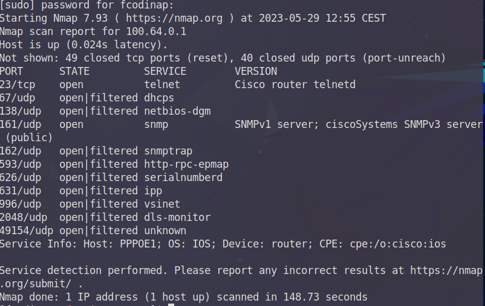

## Escaneig i ennumeració de xarxa amb NMAP
### Lloc Official Eina
- https://nmap.org/

--- 


### Descobriment de dispositius, enumeració de serveis i superfície exposada inicial

Per entendre una mica el funcionament d'aquesta eina tant potent, una de les primeres coses que s'ha d'entendre és el de
la construcció de les comandes. Una comanda bàsica esta formada de la següent manera:

`nmap [tipus _escaneig] [opcions_escaneig] {objectiu}`

On

`Tipus_escaneig:`  
Paràmetres que solen determinar els tipus, nombre i freqüencia de paquets o sondes que es generaran per realitzar l'escaneig.
Si no s'especifica cap tipus d'escaneig, NMAP realitzarà l'escaneig per defecte que inclou un paquet TCP amb la flag ACK
al port 80 així com un ICMP ECHO REQUEST a cada objectiu especificat.

`Opcions:`  
Paràmetres que especifiquen alguns valors a la comanda com objectius, ports, fitxers de sortida, precisió i d'altres. Algunes
de les opcions per defecte en cas de no especificar opcions són:

- Sortida per STDOUT  
- Primers 1000 ports de la llista de ports més habituals (veure llista ports NMAP)  
- Resultats bàsics sense anàlisi en profunditat  

`Objectius:`  
Mitjançant l'ús d'opcions o bé especificats de manera manual, pot acceptar diferents formats (notació CIDR o rangs .X-X 
per exemple)

A continuació es descriuen algunes de les comandes i tècniques bàsiques que es poden utilitzar per al descobriment de la xarxa:

--- 

#### Ping Sweep

Es tracta d'un escaneig molt bàsic on s'envien sondes ICMP_REQUEST.

#### Comanda: Ping Seep  
`nmap -sP <rang_adreces>`

#### Execució  
Una dels primers escaneijos a realitzar serà el d'establir la superfície exposada de la xarxa, és a dir, des de la posició
inicial de l'atacant, quins hosts són visibles. Per fer-ho es realitzarà un ping sweep amb els prefixes reservats per a 
CGNAT i amb els prefixes que corresponen a IP publiques dels que te assignats la ISP. Totes aquestes adreces ja es troben
en un arxiu creat durant la fase de reconeixement.

`cat cgnat_prefix.txt > tmp_list`  
`cat public_prefix.txt >> tmp_list `  
`sudo nmap -sP -iL tmp_list `  
`echo "" > tmp_list`  

Degut a que s'estan escanejant multitud d'adreces, aquest pot allargar-se una mica. Una vegada s'ha realitzat emmagatzemem
els hosts com a actius per a futurs escaneigs. Cal notar que s'ha realitzat mitjançant missatges ICMP i per tant és possible 
que regles ACL o tallafocs hagin bloquejat molts d'aquests missatges i per tant existeixin molts més hosts dels que apareixen
en aquesta llsita inicial. En escaneigs futurs ja s'analitzarà aquesta situació.

`cat active_hosts.txt | grep 'Nmap scan' | awk '{print $5}' > active_hosts.txt`

> 100.64.0.129
> 100.64.0.131

Els hosts que apareixin en aquesta llista seran hosts actius que responen a missatges ECHO REQUEST

---  

#### Ping Sweep

Es tracta d'un escaneig molt bàsic on s'envien sondes ICMP_REQUEST.

#### Comanda: Ping Sweep  
`nmap -sP <rang_adreces>`

#### Execució  
Una dels primers escanejos a realitzar serà el d'establir la superfície exposada de la xarxa, és a dir, des de la posició
inicial de l'atacant, quins hosts són visibles. Per fer-ho es realitzarà un ping sweep amb els prefixes reservats per a 
CGNAT i amb els prefixes que corresponen a IP publiques dels que te assignats la ISP. Totes aquestes adreces ja es troben
en un arxiu creat durant la fase de reconeixement.

`cat cgnat_prefix.txt > tmp_list`  
`cat public_prefix.txt >> tmp_list `  
`sudo nmap -sP -iL tmp_list `  
`echo "" > tmp_list`  

Degut a que s'estan escanejant multitud d'adreces, aquest pot allargar-se una mica. Una vegada s'ha realitzat es desen
els hosts com a actius per a futurs escaneigs. Cal notar que s'ha realitzat mitjançant missatges ICMP i per tant és possible 
que regles ACL o tallafocs hagin bloquejat molts d'aquests missatges i per tant existeixin molts més hosts dels que apareixen
en aquesta llista inicial. En escaneigs futurs ja s'adreçarà aquesta situació, ara de moment interessa fer-se una idea 
inicial de 'l'oberta' que es troba la xarxa.

`cat active_hosts.txt | grep 'Nmap scan' | awk '{print $5}' > active_hosts.txt`  

> 100.64.0.129  
> 100.64.0.131  

Els hosts que apareixin en aquesta llista seran hosts actius que responen a missatges ECHO REQUEST

---  
 
#### Enumeració extensa de ports i serveis

Es realitza una extensió de l'ennumeració de ports per defecte afegint informació addicional sobre els serveis.

#### Opcions utilitzades 


- `-Pn`: Tracta tots els objectius com actius (Skip Host Discovery).
- `-sS`: Sonda TCP SYN, per protocols que utilitzen TCP (SYN Stealth Scan).
- `-sU`: Sonda UDP (UDP Scan).
- `-sV`: Determina versió serveis de ports oberts (Service Scan).
- `-oG`: Genera fitxer de sortida en format grepable.
- `-sO`: Sondes ICMP per a protocol IP (IP port Scan).
- `--script=<NSE_script>`: Executa un script de la llista NSE de NMAP.

#### Execució  
Una vegada s'ha determinat que existeix un espai d'adreces CG-NAT, un escaneig sobre aquest retornarà no només tots aquells
dispositius a nivell d'accés sinó possibles servidors PPPoE que es sap que s'encarreguen normalment d'enllaçar la distribució
i l'accés. Aquest escaneig resulta realment exhaustiu i es busquen tots els possibles serveis actius a la capa d'accés de
la xarxa que es puguin utilitzar per pivotar cap a la capa de distribució. 

Adicionalment donarà una idea aproximada de l'abast de la xarxa. És possible que interessi realitzar aquest escaneig en 
segon pla i poder anar realitzant altres tasques mentre aquest s'executa (256 hosts * TCP ports + UDP ports * 3 scans ). 
Una vegada finalitzi caldrà realitzar tasques de classificació d'informació. Per simplificar l'exemple en aquest cas només
es passarà una adreça de tot el rang 100.64.0.0/24 i es reduiran el nombre de ports als 100 més comuns amb `--top-ports 100`. 

`sudo nmap -Pn -sS -sU -sV -oG extended_enumeration 100.64.0.1 --top-ports 50`



Opcionalment i a partir dels resultats obtinguts a la fase de reconeixement i els coneixements descrits a la part teorica, 
es poden limitar els ports a aquells que són de més rellevància en una ISP o que es sap que podran resultar objectius 
d'explotacions: PPPoE, OSPF, BGP, SSH, TELNET, FTP o SNMP entre d'altres. La diferencia Entre un i altre escaneig és la que
es pot entendre com a ennumeració passiva i ennumeració activa respectivament. per a tal efecte s'ha creat una llista d'aquells
ports que es creuen més importants al fitxer ISP_ports.txt. Cal notar que alguns d'aquests protocols no són protocols
d'aplicació i per tant no es podran ennumerar com a serveis, sino que es necessitarà d'altres metodes d'escaneig com l'ús 
de scripts NSE o l'escaneig del protocol IP on la majoria d'aquests es troben encapsulats. En el següent cas s'utilitza
la opció -sO i cal tenir en conte que aquesta utilitzarà missatges ICMP, que tal i com s'ha descrit pot trobar-se filtrat.

`sudo nmap -Pn -sV -oG extended_enumeration.txt 100.64.0.0/24 -p cat ../lists/ISP_ports.txt`  
`sudo nmap -sO -oG extended_IP_enumeration.txt 100.64.0.0/24`  
`sudo nmap --script=broadcast-ospf2-discover -oG extended_ospf_enumeration.txt`  
`sudo nmap --script broadcast-pppoe-discover -oG extended_pppoe_enumeration.txt`  

- En el segon escaneig de protocols IP s'ha realitzat un descobriment de hosts (eliminant la opció -Pn) ja que com que aquest
es realitza mitjançant ICMP no te sentit realitzar-ho dues vegades.

- El tercer i quart escaneig és possible que no retornin cap resultat ja que es realitzen sobre la interfície per on s'envien
i aquesta connecta amb un dispositiu de la capa d'accés que no hauria de formar part ni de l'àrea OSPF ni tractar-se d'un
dispositiu que realitzi tasques de servidor PPPoE. Tot i així, al tractar-se d'escaneigs ràpids val la pena realitzar-los
ja que resultats en aquests dos significaria que el disseny de la xarxa no s'ha realitzat correctament i portaria a una
explotació de la xarxa sense haver d'accedir a la capa de distribució.

Per últim, un escaneig que pot ajudar a acabar d'establir la topologia i disseny de la xarxa és una cerca de portes d'enllaç.
Aquest únicament servirà per poder identificar alguns dispositius com servidors PPPoE o el BGN. Es tracta d'un escaneig
en el que s'intenta endevinar aquests dispositius mitjançant l'adreçament que s'utilitza per defecte per aquests, que sol ser
o be la primera o be la última adreça de cada rang. (.1/.254). Per exemple, 100.64.0.1,62,65,126,129,190,  per a l'espai CGNAT 
d'aquest treball o 203.0.113.1,127,129,254 per a l'espai d'adreces públiques d'aquest treball. En escaneigs anteriors ja es
poden haver identificat aquests dispositius, tot i així realitzar aquest escaneig específic i ràpid podria afegir informació.

`sudo nmap -Pn -sV -iL ../lists/gateways_IP.txt -oG possible_gateways.txt --top-ports 25`  

Una vegada realitzats els escaneigs, resultats dels quals s'han volcat en els seus arxius corresponents, caldrà preparar
la informació de cara a la següent fase. Gràcies al format grepable amb el que s'exporten els resultats de les comandes
resulta senzill treballar amb aquesta informació. El programa prep_info.sh és un exemple de com es podria deixar ennlestida
aquesta informació per disposar d'ella en fases posteriors del pentest.

```
*************************************
EXTENDED NMAP SCAN EXAMPLE BRIEF FILE
*************************************
 
----------------------------------------------------------------------------------------------------------
 Scan command: sudo nmap -Pn -sV -oG extended_enumeration.txt 100.64.0.0/24 -p cat ../lists/ISP_ports.txt
----------------------------------------------------------------------------------------------------------
 
######## PORT SCAN RESPONSIVE HOSTS ########
 
100.64.0.1
100.64.0.2
 
##### OPENED PORTS LIST (NO FILTERED) ######
 
22 tcp ssh
23 tcp telnet
 
----------------------------------------------------------------------------------------------------------
 Scan command:  sudo nmap -sO -oG extended_IP_enumeration.txt 100.64.0.0/24
----------------------------------------------------------------------------------------------------------
 
######## IP SCAN ACTIVE HOSTS ########

100.64.0.1
100.64.0.2
 
##### OPENED OR FILTERED IP PROTOCOLS  ######
 
1 icmp 
132 sctp 
17 udp 
46 rsvp 
47 gre 
50 esp 
51 ah 
6 tcp 
77 sun-nd 
88 eigrp 
 
----------------------------------------------------------------------------------------------------------
 Other Scans:  sudo nmap --script=broadcast-ospf2-discover -oG extended_ospf_enumeration.txt
 Other Scans:  sudo nmap --script broadcast-pppoe-discover -oG extended_pppoe_enumeration.txt
----------------------------------------------------------------------------------------------------------
 
######## OSPF DETAILS########
 
# Nmap 7.93 scan initiated Mon May 29 13:49:25 2023 as: nmap --script=broadcast-ospf2-discover -oG extended_ospf_enumeration.txt
# Nmap done at Mon May 29 13:49:35 2023 -- 0 IP addresses (0 hosts up) scanned in 10.27 seconds
 
######## PPPoE DETAILS ########
 
# Nmap 7.93 scan initiated Mon May 29 13:49:38 2023 as: nmap --script broadcast-pppoe-discover -oG extended_pppoe_enumeration.txt
# Nmap done at Mon May 29 13:49:48 2023 -- 0 IP addresses (0 hosts up) scanned in 10.26 seconds
```


---

Els exemples d'escaneig i ennumeració presentats en aquest apartat són un dels molts que es poden dur a terme. Existeixen
ultitud de combinacions entre opcions i NSE scripts que es poden realitzar per dur a terme aquesta fase d'escaneig mitjançant
NMAP, i quedarà en les mans dels responsables del pentest de determinar quins procediments es duen a terme. Per altra banda, 
tal i com s'ha descrit al llarg de la memoria, el proces d'un pentest és iteratiu i les fases d'aquest es van alimentant
dels resultats de la resta. A mida que es vagi pivotant o realitzant accessos a diferents dispositius de la xarxa, s'hauran
de dur a terme nous escaneigs i enumeracions per veure si la superfície exposada d'aquesta ha augmentat i per tant es poden
trobar nous dispositius i protocols a explotar.

Per últim cal tenir en conte, entendre i saber interpretar els resultats en funció de la posició des de la que s'estigui 
realitzant l'escaneig. L'obtenció o la no obtenció d'alguns serveis que s'esperaria observar pot determinar el possible
disseny de la xarxa. Només amb experiéncia i coneixements en xarxes d'aquest tipus i l'ús de l'eina NMAP millors resultats
s'obtindran, ja que l'adaptació de les comandes i les seves opcions in situ per aquesta eina poden resultar determinants 
per a l'éxit d'aquesta fase.

--- 

> **NOTE**  
> Al directori del repositori s'hi poden trobar exemples addicionals d'escaneig de la xarxa mitjançant ping i traceroute.
> S'ha decidit no inclourel's a la memoria ja que aquestes eines són eines bàsiques i els exemples no aportàven valor a
> l'apartat.


