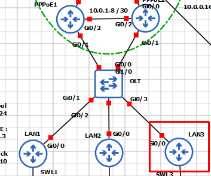
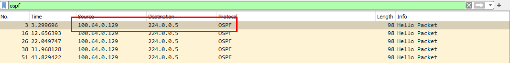
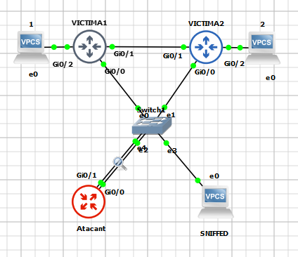
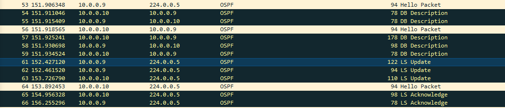
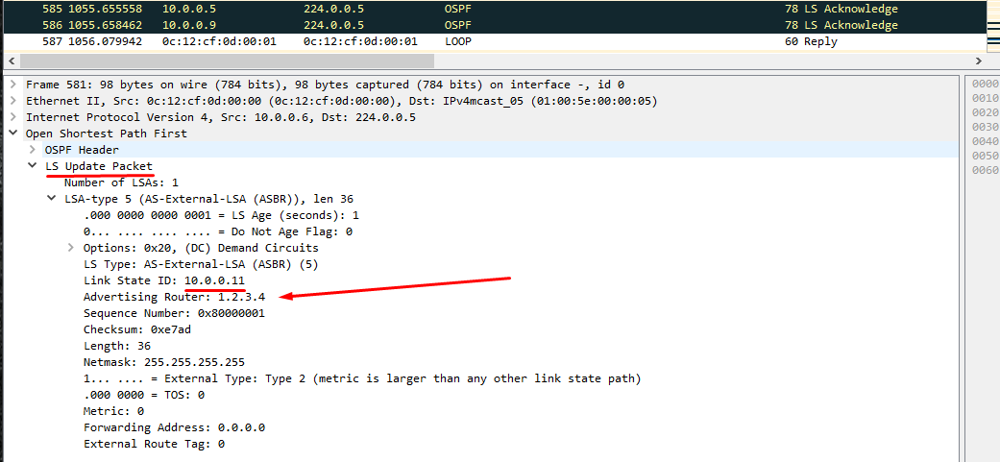
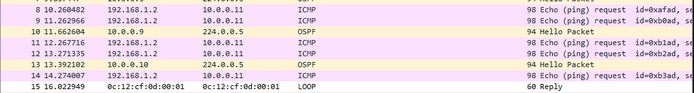

## Atacs a IGPs
  
### Open Shortest Path First (OSPF)

####  Breu Resum d'OSPF

OSPF és un protocol d'encaminament intern que es basa en els paràmetres i estat dels enllaços (Link State Routing) que
uneixen els diferents dispositius que l'implementen i que comparteixen rutes d'encaminament entre ells. Entre tots els
elements que formen el conjunt del protocol n'hi alguns que cal coneixer en profunditat per entendre com es pot arribar
a atacar aquest protocol:

- **Àrea OSPF**   
Es tracta de l'area o domini per a la qual es cercaran i s'emmagatzemaran rutes d'encaminament. No es disposarà a les taules 
d'encaminament informació sobre la ruta a un dispositiu fora del domini d'aquesta.
- **Taules OSPF**
  - **Taula de veïns:** Conte una llsita de tots aquells veïns que formen part de l'àrea OSPF
  - **Taula d'encaminament:** Conte una llista del millor camí cap a cada xarxa o subdomini conegut al que es pot accedir a l'àrea
- **Paquets OSPF**
  - **Hello:** Utilitzats quan es vol establir connexió amb possibles veïns que formin part de l'àrea
  - **Link State Request:** Solicitud d'infromació a un veí per a l'obtenció de les seves taules d'encaminament o la base de dades
  - **Link State Update:** Resposta a un veí que solicita actualització de dades
  - **Link State Acknowledgement:** Resposta a l'obtenció de dades d'un veí (similar als ACK que es poden observar en el protocol TCP)  
- **Classificació dels dispositius en una àrea**
  - **DR** (Designated Router)
  - **BDR** (Backup Designated Router)

- **Formació d'adjacencies i compartició de dades**  
  - Els encaminadors que implementen OSPF envien un paquet HELLO per totes les interfícies (broadcast excepte interfícies
  passives, veure més endavant), pqaquet que inclou diferents paràmetres i conmfiguracions del protocol.
  - Una vegada formades les adjacencies, s'intercanvien les bases de dades, amb prioritat per a les que pertanyen al
  dispositiu amb més prioritat (configurada manualment o en el seu defecte per ID del dispositiu)
  - Es comparen les bases de dades rebudes amb la propia i s'envien solicituds per aquelles xarxes per a les quals no es
  disposa de camí.
  - Es respon a solicituds i s'accepten respostes a aquestes.

- **Tipus d'enllaç**
  - Interfície Activa: Els missatges anteriors s'enviaran per aquestes.
  - Interfície Passiva: Els paquets OSPF no s'enviaran per aquestes.

Aquest protocol, així com d'altres protocols de la família IGP són de vital importància en xarxes de certa complexitat o 
extensió com és el cas de la xarxa d'una ISP, ja que l'ús de CGNAT així com l'assignació dinàmica d'adreces i la gran
quantitat d'aquestes que s'han de gestionar fan iviable la gestió d'encaminament mitjançat rutes estàtiques.

Amb tot aixó, OSPF és un protocol de certa complexitat i per poder ser explotat requereix de l'existencia de certs requisits
previs, requisits que moltes vegades es poden complir degut a la manca de rigorositat a l'hora de configurar els diferents
dispositius per part dels responsables de la xarxa. A continuació es descriuen alguns dels atacs que es poden dur a terme 
en una xarxa que implementi OSPF.

> **Note**  
> Per a exemplificar d'una manera propera a la realitat aquests atacs resulta vital l'ús d'eines que simulin un encaminador
> fals, des d'on executar els atacs com per exemple paquets de protocols d'encaminament per simular dispotius com FRR o Bird
> entre d'altres (veure Routing Suites) així com eines de fabricació de paquets com [Scapy](https://scapy.net/).
> 
> Degut a la complexitat d'aquestes eines s'han simplificat aquestes i es farà ús directament d'un encaminador que simularà
> l´ús d'aquestes eines com si de la màquina atacant es tractés. En treballs futurs es contempla l'estudi, posada en marxa
> i pràctica en GSN3 d'aquestes eines .

--- 

### Injecció de Rutes i captura de trànsit (MiTM)

Una de les maneres en les que es pot explotar OSPF és la manipulació del sistema de costs i prioritats per modificar les
rutes escollides dins de la xarxa. Aquesta modificació pot ser d'utilitat per generar una posició MiTM des de la que poder
capturar infromació sensible entre dispositius.

#### Requisitis  
- És requisit indispensable poder capturar en primer lloc missatges Hello d'algun dispositiu d'una àrea OSPF, ja sigui 
per mitjà d'una interfície mal configurada que no s'ha establert com a passiva i/o al haver compromés un dispositiu de la
propia àrea OSPF.

#### Execució  

Basant-se en la topologia de la Xarxa 3 el dispositiu compromés, en aquest cas la porta d'enllaç 
d'una de les Lans a nivell d'enllaç s'ha aconseguit comprometre (accés privilegiat). Aquest és el que s'indica amb un 
requadre en vermell.

Al realitzar captures de paquets sobre la interfície upstream d'aquest dispositiu s'observen entre d'altres els següents
paquets que indiquen que OSPF podria trobar-se mal configurat i per tant seria susceptible a una explotació.

El primer pas a dur a terme és el de poder establir adjacencia, per tant configurarem OSPF al dispositiu compromés o 
generarem paquets OSPF amb un encaminador fals en el cas d'estar utilitzant algun routing suite per falsificar encaminadors.

Per exemplificar l'atac es simplificarà la topologia de la següent manera:

Es configura el dispositiu amb les comandes adients perque generi adjacencia. Les xarxes que haurà d'incloure aquest són
aquelles per les que es reben missatges OSPF ja que així es podran modificar rutes més endavant.

>router ospf 123
>router-id 1.2.3.4
> 
>network 10.0.0.4 0.0.0.3 area 10
>network 10.0.0.8 0.0.0.3 area 10

Es genera l'adjacencia amb tots aquells dispositius OSPF i s'inicia el procés de compartir base de dades i actualitzar
les LSA.

Arribats a aquest punt, el dispositiu atacant ja forma part de l'àrea OSPF. Ara bé, la comunicació entre Victima1 i Victima2
encara es realitza per la ruta més curta, ja que de passar per el dispositiu atacant hauria de realitzar 2 salts.

En aquest exemple es presenten dues opcions, la d'injecció d'una ruta estàtica que es distribuirà a tota l'àrea ospf i la
de modificació de costs de rutes.

- Injecció de ruta
Des del dispositiu atacant s'indicarà a la configuració OSPF que es volen distribuir rutes amb la comanda
`redistribute static metric 0`  

Seguidament es crearan les rutes, en el cas de l'exemple, s'indicarà que per arribar a SNIFFED (10.0.0.11), la ruta a
seguir serà per la interfície de l'atacant g0/0 (altrament es pot indicar una adreça)

`ip route 10.0.0.11 0.0.0.0 g0/1`

La injecció de la ruta es pot validar quan s'observen nous missatges OSPF compartint aquesta nova ruta

I mitjançant la captura de paquets per part de l'atacant que van destinats a un altre dispositiu, confirmant així la creació
d'una posició MiTM (imatge 1). Addicionalment la comanda `show ip route` en un dels dispositius atacats de l'area 
OSPF disposa de la ruta injectada a la seva taula (imatge 2)

--- 

### Desbordament de Taules d'encaminament (DoS)

#### Requisitis  

#### Comandes a dispositius cisco  
  

#### Execució  

--- 

### Ennumeració de Xarxa Avançada (augment de superfície exposada)

#### Requisitis  

#### Comandes a dispositius cisco  
  

#### Execució  

--- 