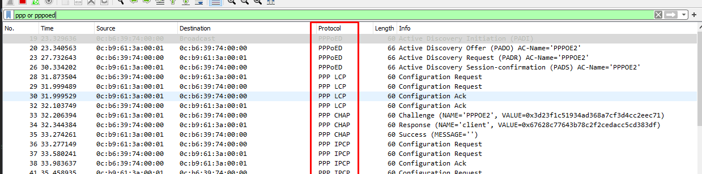
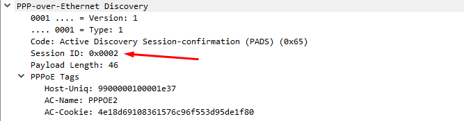

## Disrupció de PPPoE Protocol

### Point-to-Point over Ethernet (PPPoE)

A l'inici d'aquest treball s'ha descrit per sobre com les ISP d'avui en dia provenen de les companyies de telefonia de fa
uns anys. Als inicis d'internet, quan les conexions a aquesta circulàven per linies de telefon, el seu funcionament no
diferia molt d'una trucada: S'establia connexió entre dos punts que la companyia controlava i facturava sobre la durada 
d'aquesta. Un dels protocols que van apareixer per poder realitzar aquesta connexió (i les característiques d'aquesta) així
com la seva monitorització va ser PPP (Point-to-Point). Amb els anys, quan la capacitat requerida per les connexions per
internet així com la aparició d'Ethernet, aquest protocol que seguia oferint una funcionalitat per a les companyies envers
els clients que contractàven serveis d'accés a internet va necessitar d'una adaptació, en aquest cas mantenint les funcionalitats
d'autentificació i connexió punt-a-punt pero ara a través d'un enllaç entre els punts 'visrtual'. En comptes de perdre aquestes
funcionalitats el que es va decidir va ser encapsular PPP en trames anomenades PPPoE, que a la seva vegada van encapsulades 
en trames Ethernet.

El funcionament, descrit de manera molt simple és el següent:

- Al tractar-se d'una estructura Servidor-Client, el client solicita la connexió a qualsevol servidor a l'escolta.
- Seguidament el servidor ofereix unes condicions.
- S'identifiquen els dos punts que es volen connectar, en aquest cas al trobar-se a la capa d'enllaç es realitza a través
  d'adreces MAC.
- El client accepta aquestes condicions i el servidor respon amb les configuracions per a generar l'enllaç virtual punt-a-punt
sobre la xarxa.
- Una vegada generat l'enllaç es duen a terme intercanvis de missatges per configurar l'enllaç: autentificació, limitacions, ...

Aquest procés es pot descriure també amb els missatges enviats entre client i servidor:

> **PPPoE**  
> PADI (Client) --> PADO (Servidor) --> PADR (Client) --> PADS (Servidor) ...   
> **PPP**  
> ... PPP LCP (Client i Servidor) --> PPP CHAP Challenge (Servidor) --> PPP CHAP Response (Client) --> PPP IPCP (Client i Servidor) ...
> 

Aquest procés que ressembla al que es realitza amb d'altres protocols com OSPF o TCP, segueix una seqüencia ben clara i definida
i resulta de vital importància per al control i gestió de connexions en un AS com el d'una ISP per a dur un control sobre 
els serveis que proporciona als seus clients. Si BGP és la clau de l'encaminament per a les connexions fora de l'AS i OSPF
és la pedra angular de l'encaminament intern, PPPoE és l'encarregat de generar aquells camins per on circularà el trànsit
des d'un client a qualsevol punt de la xarxa, és per aixó que es parla també de protocol de generació de túnels.

A la següent imatge es pot observar la seqüencia descrita anteriorment entre un client PPPoE i un Servidor PPPoE. Aquesta
s'ha obtingut de la captura de paquets mitjançant Wireshark de la que disposa el simulador GSN3 i que permet establir punts
de captura en qualsevol enllaç de la xarxa. En aquest cas el punt és entre el OLT i un dels clients PPPoE de la xarxa (LAN2).

Al tractar-se d'un protocol de tanta rellevància per a la xarxa d'una ISP, els atacs a aquest, en cas de tenir éxit poden
comportar problemes molt grans sobretot quan es tracta de denegacions de serveis, ja que els clients depenen completament 
d'aquest protocol per poder disposar d'accés a internet. Tot i aixó, PPPoE resulta un protocol robust i bastant protegit,
per al que ha resultat difíl durant aquest treball de trobar tecniques o atacs basats en aquest. Els pocs que s'han trobat
han suposat tot un repte a l'hora d'entendre el seu funcionament i en la majoria de casos ha sigut impossible realitzar exemples
degut a la compelxitat que suposa dur-los a terme i la manca de capacitats tecniques i coneixements dels que es disposen 
per executar-los.

Tot i així s'ha realitzat un exercici d'estudi d'algun d'aquests atacs de cara a entendre com es podria interrompre el seu
correcte funcionament i que e spodrà llegir als següents capítols de l'apartat.

--- 

### Termiació de Sessions amb Missatges PADT (Client DoS)

Un dels tipus de missatges que no s'han mencionat a la introducció d'aquest apartat són els PADT o PPPoE Active Discovery
Terminate. Aquest missatge que tan pot ser enviat per el client com per el servidor indica a l'altre punt amb el que es 
disposa de sessió, que aquesta s'ha de cancelar. No és d'extranyar per tant que es pugui veure l'ús d'aquest missatge com
a mitjà per realitzar atacs de denegació de serveis sobre clients. En aquest apartat es presenta una possible aplicació 
d'aquest atac i el seu objectiu no serà altre que la terminació de sessions de clients, que tot i que no resulta en conseqüencies
molt greus per a la xarxa si que resultarà una inconveniencia per el servei que la ISP ofereix als seus clients. L'atac
plantejat amb Scapy és molt senzill, pero necessita d'uns requisits molt específics que no sempre es podran donar.

#### Requisitis  

- Es requereix d'una posició MiTM entre el servidor PPPoE i els clients o bé comprometre el servidor en si mateix de cara
a poder capturar els identificadors de sessions.

#### Execució  

L'execució d'aquest atac, s'inicia amb l'obtenció de l'identificador de sessió entre un client i el servidor. Aquest valor
es pot trobar a la majoria de paquets PPPoE sota el nom de Session-ID i és un valor que s'ha assignat per part del servidor
i que s'envia per primera vegada amb el missatge PADS.

Una vegada s'ha obtingut, s'emagatzema en una variable amb Scapy juntament amb l'adreça MAC del client en la forma de parell
de valors, que es podran emmagatzemar per cada client i així realitzar un atac multidirigit per exemple.

`pppoe_session=[2, '0c:2b:f2:74:00:00']`

Seguidament es realitza la construcció del paquet PADT

`fake_PADT =  Ether(src='0c:2b:f2:74:00:00', dst='0c:b9:61:3a:00:01') 
              / PPPoED(version=1, type=1, code=167, sessionid=2)`  

Addicionalment s'ha de construir el paquet PPP, ja que tal i com s'ha observat forçat el tancament d'un dels dos dispositius, 
primer s'envia una terminació de PPP seguit del PADT. Quan es construeixen els missatges amb Scapy cal revisar correctament
la documentació d'aquesta contribució, ja que existeixen petites diferencies de construcció de paquets segons el tipus.
En aquest cas, el PADT s'ha de construir amb PPPoED() mentre que el missatge previ de PPP i LCP fan ús de la capçalera PPPoES()
o session information.

`fake_termination = Ether(src='0c:2b:f2:74:00:00', dst='0c:b9:61:3a:00:01') 
                    / PPPoE(version=1, type=1, code=0, sessionid=2) 
                    / PPP(proto=0xc021) 
                    / PPP_LCP_Terminate(code=5, id=2)`  

Per últim s'envien els dos missatges per realitzar la finalització forçada de la sessió. En cas de disposar de multiples 
victimes simplement s'haurà de procurar que ambdós missatges per a cada víctima sigui consecutiu, ja que si PPP realitza
un ECHO_REQUEST amb un missatge PPP_LCP entre els dos, l'efecte no serà l'esperat. per evitar aquest comportament inesperat
es pot contemplar generar amb scapy un ECHO_REPLY amb codi 3 (unreachable) i afegir-ho a cada parella de paquets per intentar
evitar que els PPP_LCP mantiguin viva la sessió (*No s'ha pogut comprobar*).

`end_session = (fake_termination, fake_PADT)`  

`for p in end_session:`  
  `sendp(p)`
  
Tal i com s'ha comentat, aquest atac és relativament limitat i el seu impacte es redueix a la finalització d'una sessió,
que serà regenociada de nou tan bon punt el client envii de nou un PADI. Una evolució natural d'aquest atac seria doncs la
de la simulació d'un servidor PPPoE. Una vegada s'ha finalitzat una sessió, mitjançant la captura de paquets, s'hauria
d'interceptar el primer PADI que aparegués per la xarxa i realitzar l'inici de sessió amb el client abans de que ho fes 
el servidor real mitjançant els PADO i PADS corresponents.

Un servidor PPPoE, a banda de servir per generar sessions amb els clients realitza l'assignació de configuració a l'enllaç
virtual entre els dos punts a través de PPP. Entre aquestes configuracions es pot trobar l'adreça IP que s'assigna, així
doncs es pot entendre el servidor PPPoE com una especie de DHCP. Aquest detall identifica un dels possibles objectius del
procés d'intentar tancar per despres renegociar sessions, i és el d'exhaurir l'espai d'adreces del que es disposa per als 
clients. Si s'aconsegueixen obrir prous sesions i assignar adreces, el servidor PPPoE es trobarà que no en disposa de més 
per assignar a nous clients, fet que degenerarà en una denegació de servei per exhauriment d'adreces. Un enfocament similar 
a l'anterior seria el d'exhaurir identificadors de sessió d'un servidor. En aquest cas la direcció de l'atac seria l'invers, 
enviant missatges PADI per solicitar sessions falses a un servidor.

Amb tot, aquests atacs poden arribar a ser molt complexes i es requereix d'una experiencia amb l'ús d'eines com scappy 
així com del funcionament del protocol per poder dur amb exit atacs d'aquest tipus. Ara bé, si es du a terme amb éxit un
atac d'aquest tipus, de la mateixa manera que passa amb OSPF, resultarà complicat per par de l'administrador de la xarxa
de mitigar-ne els efectes, doncs resulta difícil rastrejar la procedencia a simple vista i el més probable és que el servidor
PPPoE s'hagi de reiniciar i reconfigurar.