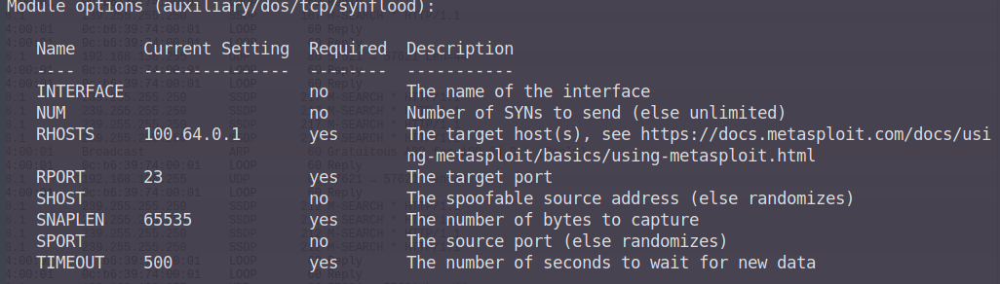
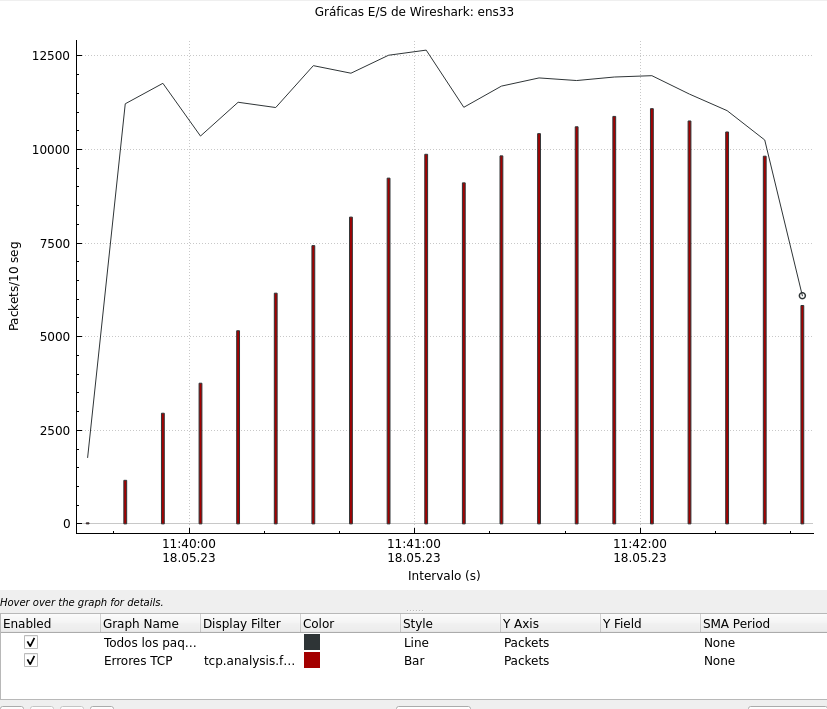
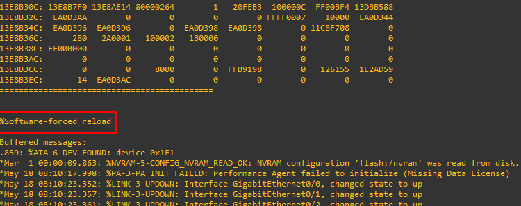

## SYN flood
### Metasploit Framework: Auxiliary Synflood Module
https://www.infosecmatter.com/metasploit-module-library/?mm=auxiliary/dos/tcp/synflood

--- 

### Denegació de Servei per desbordament de connexions TCP

#### Requisitis  
- Servei TCP actiu al dispositiu victima  
- Credencials(en el cas de que es requereixin)   

Una de les tècniques més esteses i utilitzades per a realització de denegació de serveis degut a la seva senzillesa és la
de SYN flood . Aquesta explota el funcionament del protocol TCP, que requereix de la generació d’una comunicació entre client 
i servidor mitjançant el que ja s’ha descrit en anteriors apartats com a 3-way-handshake. En un cas normal d’establiment 
de connexió entre servidor i client, el segon enviarà una sol·licitud al servidor per iniciar aquesta, al que el servidor 
respondrà amb un SYN-ACK, reconeixent que s’establirà connexió amb el client juntament amb els ports que s’utilitzaran. 
Arribats a aquest punt, si es realitza aquest procés multitud de vegades, es poden arribar a obrir suficients connexions 
i arribar al punt en el que el servidor ja no disposarà de la possibilitat de gestionar més connexions, i per tant denegant 
l’accés a aquest.

#### Opcions i Paràmetres Especials  

Abans d'iniciar cap prodcediment caldrà establir les variables d'entorn a metasploit. L'objectiu d'aquest atac serà un
dels dispositius descoberts que realitza la funció de servidor PPPoE amb adreça 100.64.0.1 i el port TCP escollit.

`set RHOST 100.64.0.1`  
`set RPORT 23`  

#### Execució  
Una vegada s'han estalbert els objectius, l'execució d'aquest atac és ben senzilla. En primer lloc iniciarem el modul a 
msconsole i revisarem que les variables siguin les correctes.

`use synflood`  
`show options`  

S'inicia el *flooding* amb la comanda `exploit`. Als pocs segons d'iniciar l'execució, la capacitat per realitzar accions a través
de la linia de consola en el dispositiu ja resulta complicada i lenta degut a l'exhauriment de recursos d'aquest. Si es fa
una ullada als paquets enviats i rebuts amb wireshark, es pot observar aquest desbordament de solicituds SYN enviades.

Els errors marcats en vermell es corresponen a errors degut a manca de ports disponibles. A mida que l'atac es va executant,
cada vegada hi ha més peticions de sessió pendents i per tant menys ports disponibles. En qüestió de 3 minuts, el dispositiu
ha exhaurit recursos i és forçat a reiniciar, tal i com es pot observar per la sortida per consola

Aquest tipus d’atacs són fàcils d’identificar per part de la víctima i els sistemes de detecció que implementi, ja que es 
genera un volum de trànsit inusual en poc temps i es consumeixen recursos del sistema de manera atípica. Així mateix els 
mecanismes de defensa són relativament fàcils d’implementar (bloqueig de IP, first packet drop , increment en capacitat 
de recursos, millor configuració de camps com timeout), i per tant, des del punt de vista de l’atacant, tot i que l’objectiu 
principal pot ser denegar el servei, cal  entendre l’ús d’aquests atacs com a distraccions per dur a terme altres explotacions.

Les conseqüencies resultants d'aquesta explotació poden utilitzar-se per a les
següents raons:

- Forçar reinici d'un dispositiu en una àrea OSPF per forçar una nova elecció de designated router (DR) de l'àrea
- Forçar reinici per carregar configuració modificada en un dispositiu
- Forçar reinici per habilitar l'ús d'un servidor PPPoE fals que suplantarà el dispositiu atacat.
- Afectació de la capacitat de trànsit a la xarxa (limitant el nombre de paquets SYN enviats)
- Distracció mentre es realitzen altres atacs a la xarxa.

